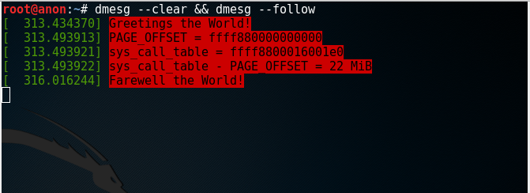
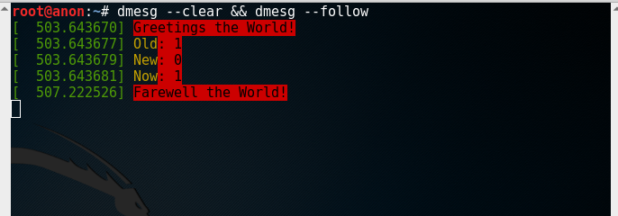
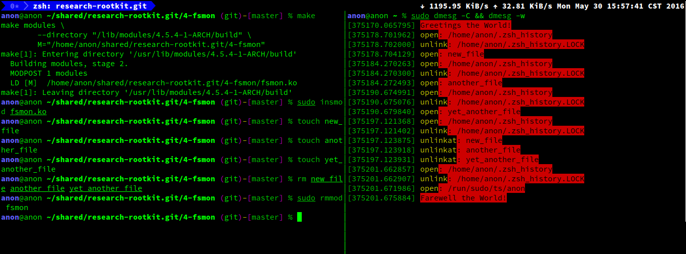

Linux Rootkit 研究
@@@@@@@@@@@@@@@@@@

Linux Rootkit 系列二：基于修改 `sys_call_table`_ 的系统调用挂钩
===============================================================

rectigu@gmail.com, 二〇一六年五月。

前言： `《Linux Rootkit 系列一： LKM 的基础编写及隐藏》`_
的作者似乎跑路了；留下的这个口锅，我试着背一下。
鉴于笔者知识能力上的不足，如有问题欢迎各位扔豆腐，不要砸砖头。

与第一篇文章作者所想象的不同，
本文不打算给大家介绍三种不同的系统调用挂钩技术，
相反，本文仅详细讲解最简单的系统调用挂钩方案，
并且基于这个方案实现最基本的文件监视工具。
这样，既可以让读者轻松上手进行实际应用，
又可以加深、巩固读者对 LKM_ 的理解，
同时还免去了一次学习多种挂钩方案的理论知识压力。

所以，本文力求以实验为核心，每一个步骤都可能有对应的实验代码。
代码仓库： https://github.com/NoviceLive/research-rootkit 。
代码在最新的 64 比特 Arch_ 与 Kali_ 上面测试正常。

测试建议： **不要在物理机测试！不要在物理机测试！
不要在物理机测试！**

如果读者使用 tmux_ 或者类似的工具，
则可以垂直分割你的终端窗口，
一个窗口开一个 ``sudo dmesg -C && dmesg -w`` ，用于查看日志；
另一个窗口用来做其他操作，比如构建、加载内核模块。
不用 tmux_ 也没关系，开两个终端，各占半个屏幕。

第一部分：基于修改 `sys_call_table`_ 的系统调用挂钩
---------------------------------------------------

在系统调用挂钩技术中，最简单、最流行的方案是修改
`sys_call_table`_ ，
成员类型为函数指针的一维数组。

.. code-block:: c

   asmlinkage const sys_call_ptr_t sys_call_table[__NR_syscall_max+1] = {
   	/*
   	 * Smells like a compiler bug -- it doesn't work
   	 * when the & below is removed.
   	 */
   	[0 ... __NR_syscall_max] = &sys_ni_syscall,
   #include <asm/syscalls_64.h>
   };

要修改它，首先得拿到它在内存里的位置。
然后，由于 `sys_call_table`_ 所在的内存是有写保护的，
所以我们需要先去掉写保护，再做修改。

1. 获得 `sys_call_table`_ 的内存地址
++++++++++++++++++++++++++++++++++++

在综合考量了几种可选的获取方案之后，
笔者决定采用从内核起始地址开始暴力搜索内存空间的方案。
（ **但是这种方案有可能被欺骗** 。）

其他可能的方案有，一，从 `/boot/System.map`_ 中读取，
感兴趣的读者可以查阅
`Hooking the Linux System Call Table`_ ，
这篇文章便是使用这种方案来获取 `sys_call_table`_ 的地址的。

二，从使用了 `sys_call_table`_
的某些未导出函数的机器码里面进行特征搜索，
感兴趣的读者可以查阅
`Kernel-Land Rootkits`_ ，
作者花了几张 slides
阐述了如何从导出的函数中获取使用了 `sys_call_table`_ 的未导出函数，
进而搜索那个未导出函数的机器码，
得到 `sys_call_table`_ 的地址；等等。

值得指出的是，
感兴趣的读者在测试这些本文未涉及的方案时，
如果遇到了疑惑或者困难，也可以与笔者联系、交流。

直接看代码。

.. code-block:: c

   unsigned long **
   get_sys_call_table(void)
   {
     unsigned long **entry = (unsigned long **)PAGE_OFFSET;

     for (;(unsigned long)entry < ULONG_MAX; entry += 1) {
       if (entry[__NR_close] == (unsigned long *)sys_close) {
           return entry;
         }
     }

     return NULL;
   }

`PAGE_OFFSET`_ 是内核内存空间的起始地址。
因为 `sys_close`_ 是导出函数
（需要指出的是， ``sys_open`` 、 ``sys_read`` 等并不是导出的），
我们可以直接得到他的地址；因为系统调用号
（也就是 `sys_call_table`_ 这个一维数组的索引）
在同一 ABI_ （x86 跟 x64 不是同一 ABI）上具有高度的后向兼容性，
更重要的是，我们可以直接使用这个索引（代码中的 ``__NR_close`` ）！

从内核内存的起始地址开始，
逐一尝试每一个指针大小的内存：把它当成是 `sys_call_table`_ 的地址，
用某个系统调用的编号（也就是索引）访问数组中的成员，
如果访问得到的值刚好是是这个系统调用号所对应的系统调用的地址，
那么我们就认为当前尝试的这块指针大小的内存就是我们要找的
`sys_call_table`_ 的地址。

2. 关闭写保护
+++++++++++++

写保护指的是写入只读内存时出错。
这个特性可以通过 CR0_ 寄存器控制：开启或者关闭，
只需要修改一个比特，也就是从 0 开始数的第 16 个比特。

看代码。我们可以使用 `read_cr0`_ / `write_cr0`_
来读取 / 写入 CR0_ 寄存器，
免去我们自己写内联汇编的麻烦。

函数原型。

.. code-block:: c

   static inline unsigned long read_cr0(void);

   static inline void write_cr0(unsigned long x);

关闭写保护的源代码：将 CR0_ 寄存器从 0 开始数的第 16 个比特置为 0。

.. code-block:: c

   void
   disable_write_protection(void)
   {
     unsigned long cr0 = read_cr0();
     clear_bit(16, &cr0);
     write_cr0(cr0);
   }

开启写保护的源代码：将 CR0_ 寄存器从 0 开始数的第 16 个比特置为 1。

.. code-block:: c

   void
   enable_write_protection(void)
   {
     unsigned long cr0 = read_cr0();
     set_bit(16, &cr0);
     write_cr0(cr0);
   }

在设置或者清除某个比特，我们使用了 `set_bit`_ 与 `clear_bit`_ 。
它们是 Linux 内核提供给内核模块使用的编程接口，简单易懂，
同时还免去了我们自己写那种很难读的位运算的痛苦。

函数原型。

.. code-block:: c

   static __always_inline void
   set_bit(long nr, volatile unsigned long *addr);

   static __always_inline void
   clear_bit(long nr, volatile unsigned long *addr);

3. 修改 `sys_call_table`_
+++++++++++++++++++++++++

一维数组赋值，当之无愧最简单的方案。
当然，我们需要先把真正的值保存好，以备后面之需。

.. code-block:: c

   disable_write_protection();
   real_open = (void *)sys_call_table[__NR_open];
   sys_call_table[__NR_open] = (unsigned long*)fake_open;
   real_unlink = (void *)sys_call_table[__NR_unlink];
   sys_call_table[__NR_unlink] = (unsigned long*)fake_unlink;
   real_unlinkat = (void *)sys_call_table[__NR_unlinkat];
   sys_call_table[__NR_unlinkat] = (unsigned long*)fake_unlinkat;
   enable_write_protection();

4. 恢复
+++++++

.. code-block:: c

   disable_write_protection();
   sys_call_table[__NR_open] = (unsigned long*)real_open;
   sys_call_table[__NR_unlink] = (unsigned long*)real_unlink;
   sys_call_table[__NR_unlinkat] = (unsigned long*)real_unlinkat;
   enable_write_protection();

第二部分：基于系统调用挂钩的初级文件监视
----------------------------------------

监视文件的创建与删除。
我们挂钩 `sys_open`_, `sys_unlink`_, `sys_unlinkat`_ 这三个函数，
并且在我们的钩子函数把操作到的文件名打印出来，
然后把控制交给真正的系统调用处理。

1. `sys_open`_ 的钩子函数： ``fake_open``
+++++++++++++++++++++++++++++++++++++++++

考虑到在系统运行时，对文件的读写操作从未中断，
这里只打印了进行创建操作的文件名，准确地说是，
`sys_open`_ 的 ``flags`` 中包含 `O_CREAT`_ 。

.. code-block:: c

   asmlinkage long
   fake_open(const char __user *filename, int flags, umode_t mode)
   {
     if ((flags & O_CREAT) && strcmp(filename, "/dev/null") != 0) {
       printk(KERN_ALERT "open: %s\n", filename);
     }

     return real_open(filename, flags, mode);
   }

注：这里的 `strcmp`_ 也是内核提供的。

2. `sys_unlink`_ 与 `sys_unlinkat`_ 的钩子函数： ``fake_unlink`` 与 ``fake_unlinkat``
+++++++++++++++++++++++++++++++++++++++++++++++++++++++++++++++++++++++++++++++++++++

简单处理，直接打印路径名。

.. code-block:: c

   asmlinkage long
   fake_unlink(const char __user *pathname)
   {
     printk(KERN_ALERT "unlink: %s\n", pathname);

     return real_unlink(pathname);
   }

   asmlinkage long
   fake_unlinkat(int dfd, const char __user * pathname, int flag)
   {
     printk(KERN_ALERT "unlinkat: %s\n", pathname);

     return real_unlinkat(dfd, pathname, flag);
   }

3. 测试我们的文件监视工具
+++++++++++++++++++++++++

初级的文件监视就到这了，以后我们在做进一步的改进与完善。

第三部分：参考资料与延伸阅读
----------------------------

1. 参考资料
+++++++++++

- `Linux Cross Reference`_
- `The Linux Kernel API`_
- `How the Linux kernel handles a system call`_
- CR0_

2. 延伸阅读
+++++++++++

- `Hooking the Linux System Call Table`_
- `Kernel-Land Rootkits`_

.. _《Linux Rootkit 系列一： LKM 的基础编写及隐藏》: http://www.freebuf.com/articles/system/54263.html

.. _Hooking the Linux System Call Table: https://tnichols.org/2015/10/19/Hooking-the-Linux-System-Call-Table/
.. _Kernel-Land Rootkits: http://www.kernelhacking.com/rodrigo/docs/StMichael/kernel-land-rootkits.pdf

.. _/boot/System.map: https://en.wikipedia.org/wiki/System.map
.. _LKM: https://en.wikipedia.org/wiki/Loadable_kernel_module
.. _ABI: https://en.wikipedia.org/wiki/Application_binary_interface
.. _CR0: https://en.wikipedia.org/wiki/Control_register#CR0

.. _The Linux Kernel API: https://www.kernel.org/doc/htmldocs/kernel-api/index.html
.. _set_bit: https://www.kernel.org/doc/htmldocs/kernel-api/API-set-bit.html
.. _clear_bit: https://www.kernel.org/doc/htmldocs/kernel-api/API-clear-bit.html
.. _strcmp: https://www.kernel.org/doc/htmldocs/kernel-api/API-strcmp.html

.. _Linux Cross Reference: http://lxr.free-electrons.com/
.. _read_cr0: http://lxr.free-electrons.com/ident?i=read_cr0
.. _write_cr0: http://lxr.free-electrons.com/ident?i=write_cr0
.. _sys_close: http://lxr.free-electrons.com/ident?i=sys_close
.. _sys_open: http://lxr.free-electrons.com/ident?i=sys_open
.. _sys_unlink: http://lxr.free-electrons.com/ident?i=sys_unlink
.. _sys_unlinkat: http://lxr.free-electrons.com/ident?i=sys_unlinkat
.. _sys_call_table: http://lxr.free-electrons.com/ident?i=sys_call_table
.. _PAGE_OFFSET: http://lxr.free-electrons.com/ident?i=PAGE_OFFSET
.. _O_CREAT: http://lxr.free-electrons.com/ident?i=O_CREAT

.. _Arch: https://www.archlinux.org/
.. _Kali: https://www.kali.org/

.. _How the Linux kernel handles a system call:  https://0xax.gitbooks.io/linux-insides/content/SysCall/syscall-2.html

.. _tmux: https://tmux.github.io/
